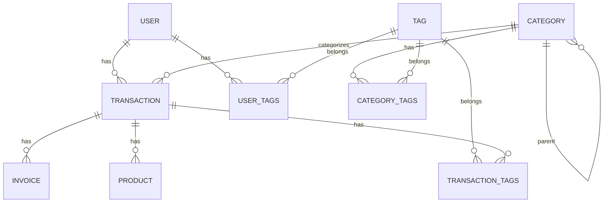

# Base de Datos

> [!info] Motor
> ORM: **GORM** con PostgreSQL

## Tablas

### User

| Campo | Tipo | Constraints |
|------|------|-------------|
| id | `uint` | PK, AUTO_INCREMENT |
| username | `varchar(50)` | NOT NULL, UNIQUE |
| email | `varchar(255)` | NOT NULL, UNIQUE, INDEX |
| password | `varchar(255)` | NOT NULL |
| avatar_url | `text` | NULLABLE |
| created_at | `timestamp` | |
| updated_at | `timestamp` | |
| deleted_at | `timestamp` | INDEX |

**Relaciones:**
- 1:N → `transactions`
- N:N ←→ `tags` (tabla pivote: `user_tags`)

---

### Category

| Campo | Tipo | Constraints |
|------|------|-------------|
| id | `uint` | PK, AUTO_INCREMENT |
| name | `varchar(100)` | NOT NULL |
| type | `varchar(20)` | NOT NULL, CHECK ('income', 'expense') |
| parent_id | `uint` | NULLABLE, FK, INDEX |
| created_at | `timestamp` | |
| updated_at | `timestamp` | |
| deleted_at | `timestamp` | INDEX |

**Relaciones:**
- 1:N → Categories (auto-referencia jerárquica)
- N:N ←→ `tags` (tabla pivote: `category_tags`)

---

### Tag

| Campo | Tipo | Constraints |
|------|------|-------------|
| id | `uint` | PK, AUTO_INCREMENT |
| name | `varchar(50)` | NOT NULL, UNIQUE (por user) |
| user_id | `uint` | NULLABLE, INDEX |
| created_at | `timestamp` | |

**Relaciones:**
- N:N ←→ `users` (tabla pivote: `user_tags`)
- N:N ←→ `categories` (tabla pivote: `category_tags`)
- N:N ←→ `transactions` (tabla pivote: `transaction_tags`)

---

### Transaction

| Campo | Tipo | Constraints |
|------|------|-------------|
| id | `uint` | PK, AUTO_INCREMENT |
| code | `varchar(100)` | NULLABLE, UNIQUE |
| type | `varchar(20)` | NOT NULL, CHECK ('income', 'expense') |
| amount | `int64` | NOT NULL, DEFAULT 0 |
| currency | `char(3)` | DEFAULT 'EUR' |
| description | `text` | |
| move_date | `date` | NOT NULL, DEFAULT current_date, INDEX |
| category_id | `uint` | NOT NULL, FK, INDEX |
| user_id | `uint` | NOT NULL, FK, INDEX |
| created_at | `timestamp` | |
| updated_at | `timestamp` | |
| deleted_at | `timestamp` | INDEX |

**Relaciones:**
- N:1 → `users` (ON DELETE RESTRICT)
- N:1 → `categories` (ON DELETE RESTRICT)
- 1:N → `invoices`
- 1:N → `products`
- N:N ←→ `tags` (tabla pivote: `transaction_tags`)

---

### Invoice

| Campo | Tipo | Constraints |
|------|------|-------------|
| id | `uint` | PK, AUTO_INCREMENT |
| transaction_id | `uint` | NOT NULL, FK, INDEX |
| file_name | `varchar(255)` | NOT NULL |
| file_url | `text` | NOT NULL |
| mime_type | `varchar(100)` | |
| uploaded_at | `timestamp` | AUTO_CREATE_TIME |
| deleted_at | `timestamp` | INDEX |

**Relaciones:**
- N:1 → `transactions`

---

### Product

| Campo | Tipo | Constraints |
|------|------|-------------|
| id | `uint` | PK, AUTO_INCREMENT |
| transaction_id | `uint` | NOT NULL, FK, INDEX |
| name | `varchar(255)` | NOT NULL |
| price | `int64` | NOT NULL |
| quantity | `int` | NOT NULL, DEFAULT 1 |
| shop_name | `varchar(255)` | |
| created_at | `timestamp` | |
| updated_at | `timestamp` | |
| deleted_at | `timestamp` | INDEX |

**Relaciones:**
- N:1 → `transactions`

---

## Tablas Pivote (Many2Many)

| Tabla | Relación |
|-------|----------|
| `user_tags` | Users ↔ Tags |
| `category_tags` | Categories ↔ Tags |
| `transaction_tags` | Transactions ↔ Tags |

---

## Diagrama de Relaciones

---

## Notas

> [!warning] Soft Deletes
> Todas las tablas principales implementan `deleted_at` para eliminación suave.

> [!tip] Cálculo de Montos
> Los campos `amount` y `price` usan tipo `Money` (`int64`) para evitar errores de punto flotante.
