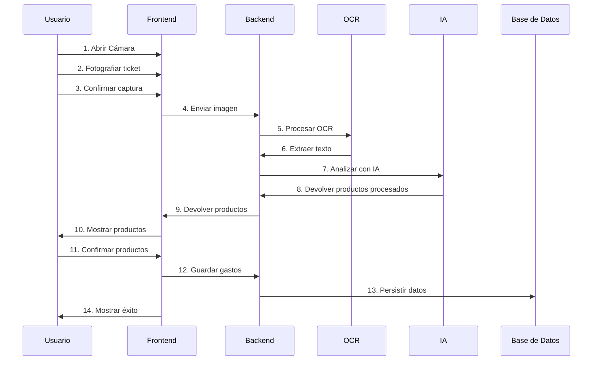
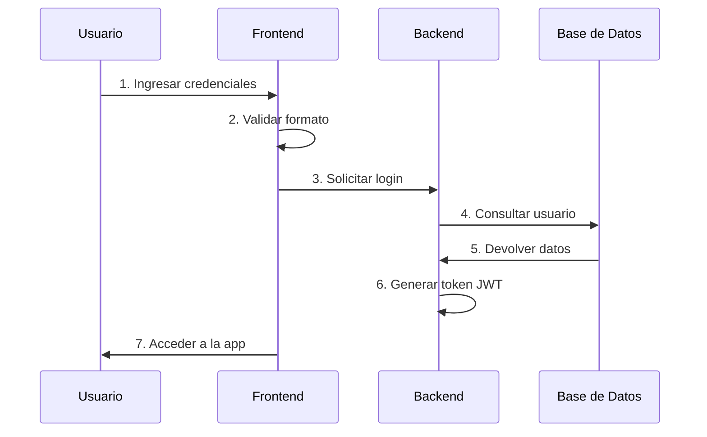
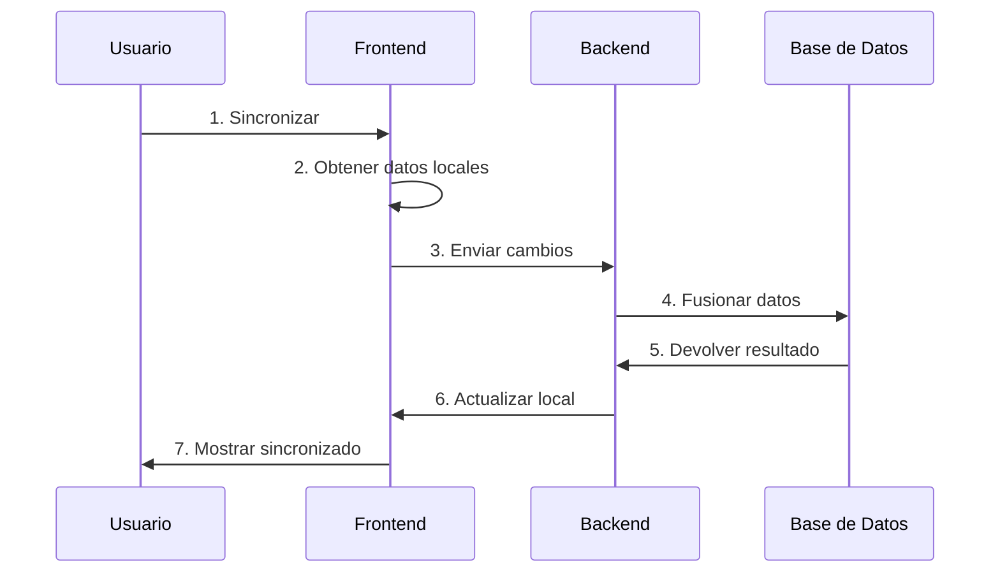
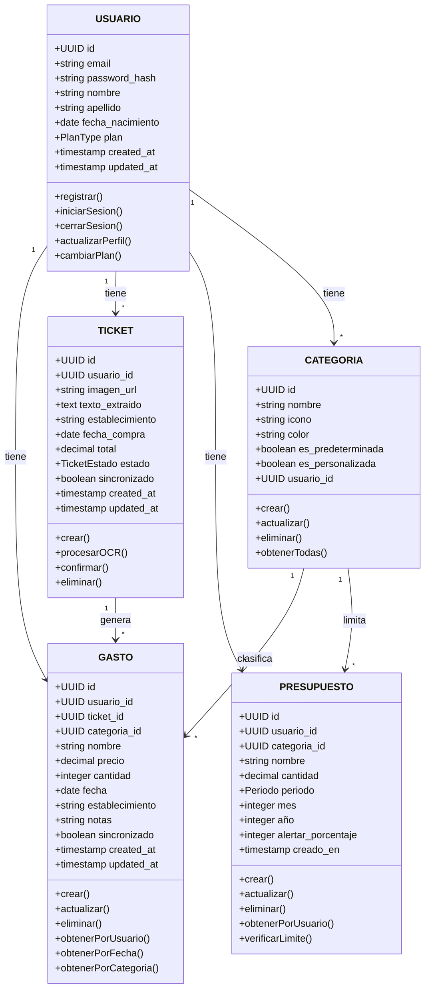
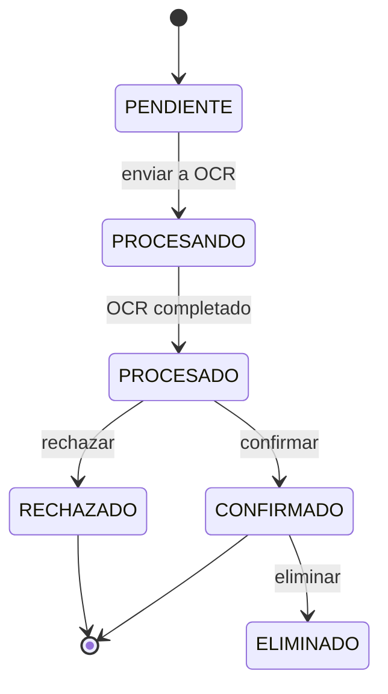
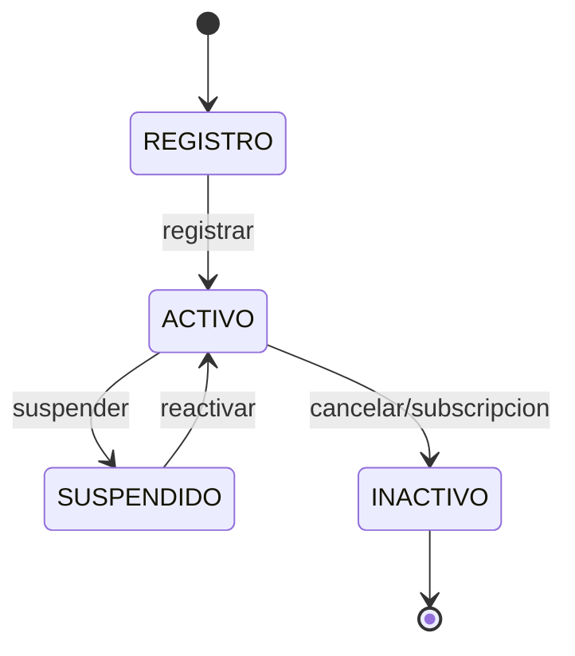
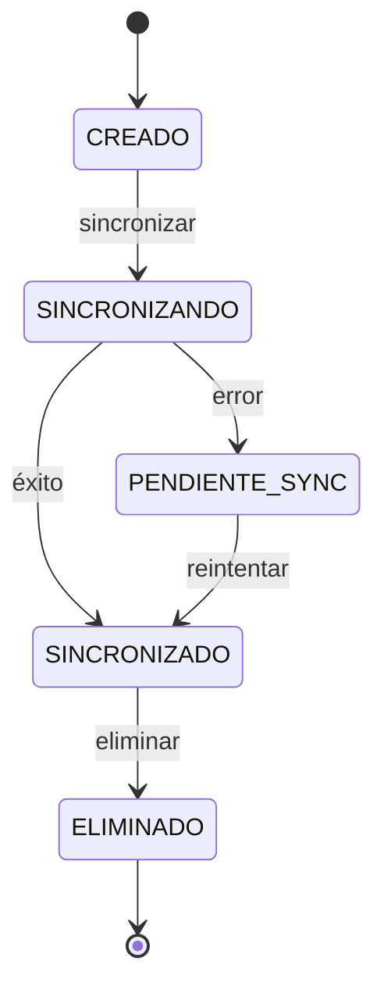
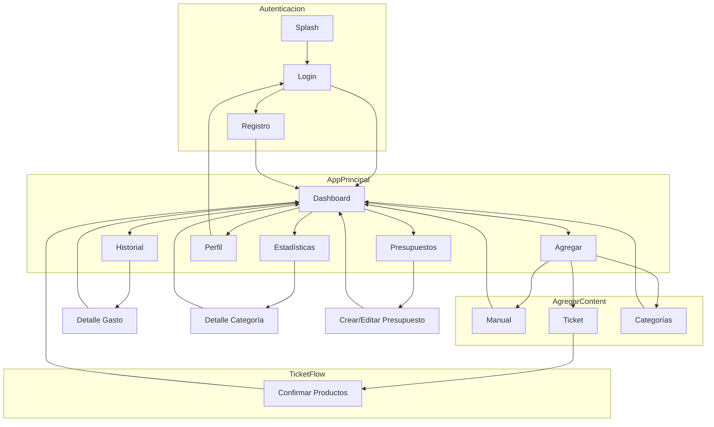
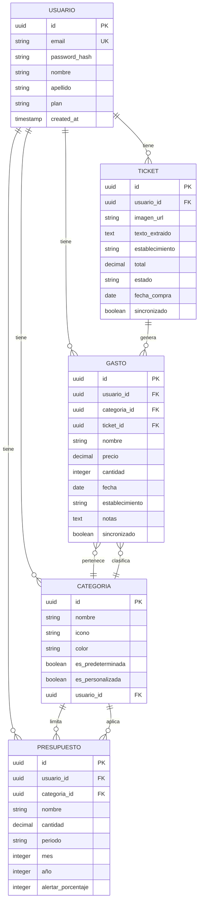

# Lumen: De la Oscuridad a la Claridad

Lumen nace de una idea simple pero potente: la mayoría de personas viven "a oscuras" respecto a su dinero.

No es que no ganen suficiente.  
Es que **no ven con claridad qué está pasando**.

Lumen no es una app financiera más.  
Es una herramienta para **iluminar el flujo del dinero**.

---

## Concepto Centr```al

### La Metáfora de la Luz

En latín, *lumen* significa **luz**.

La app actúa como una linterna:
- Ilumina gastos invisibles  
- Revela patrones ocultos  
- Hace evidente lo que antes era difuso  

No añade complejidad.  
**Reduce la oscuridad.**

---

### El Flujo como Sistema

En física, el lumen mide el **flujo luminoso**.

Esto se traduce directamente al producto:

- El dinero no es solo cantidad  
- Es **movimiento**  
- Es **dirección**  
- Es **comportamiento**

Lumen no responde a "¿cuánto tengo?"  
Responde a:  
→ **¿qué está pasando con mi dinero?**

---

## Propósito de Marca

### Transparencia  
Eliminar la opacidad. Todo debe ser visible, directo y comprensible.

### Visión  
No solo mostrar el presente, sino permitir anticipar el futuro.

### Simplicidad  
Reducir ruido. Mostrar solo lo esencial.

---

## Identidad Visual: La Materialización de la Luz

Aquí es donde la teoría se convierte en interfaz.

La clave es esta idea:

> Si el producto ilumina, la interfaz no puede ser difusa.

---

## Sistema Visual

### A. Sombras: Profundidad Física

No usamos blur.

Las sombras son **bloques sólidos**, desplazados:

```css
box-shadow: 4px 4px 0px 0px #000;
```

Esto crea una sensación de **tangible**, como si los elementos existieran en un espacio físico.

---

# 4. Diseño Aplicación Móvil

Este capítulo desarrolla el diseño completo del sistema Lumen, incluyendo la especificación funcional, el diseño técnico, la base de datos y el diseño de la interfaz de usuario.

---

## 4.1. Especificación Funcional del Sistema

La especificación funcional define qué debe hacer el sistema desde la perspectiva del usuario y los procesos que este puede realizar.

### 4.1.1. Especificación del Sistema Propuesto

Lumen es una aplicación móvil de gestión de finanzas personales diseñada para ayudar a los usuarios a registrar, analizar y comprender sus hábitos de consumo. El sistema permite el registro de productos de dos formas: manualmente o mediante el escaneo de tickets de compra utilizando tecnologías de OCR e inteligencia artificial.

El sistema está diseñado bajo una arquitectura **offline-first**, permitiendo a los usuarios utilizar las funcionalidades principales sin conexión a internet. Cuando hay conectividad, se habilitan funcionalidades avanzadas como el procesamiento automático de tickets y la sincronización de datos entre dispositivos.

#### 4.1.1.1. Descripción de los Actores

Un actor representa un tipo de usuario que interactúa con el sistema. En Lumen se identifican los siguientes actores principales:

**Actor: Usuario Registrado**

El usuario registrado es la figura central del sistema. Puede ser free o premium según el plan de suscripción contratado. Este actor representa a cualquier persona que desea gestionar sus finanzas personales de forma práctica y visual.

Características del actor:
- Puede registrar gastos manualmente o mediante escaneo de tickets
- Acceso a estadísticas y gráficos de consumo
- Gestión de categorías de productos
- Historial completo de compras y gastos
- Configuración de alertas y presupuestos

**Actor: Administrador**

El administrador gestiona los aspectos operativos del servicio. Este actor es responsable de la gestión de usuarios, monitorización del sistema y mantenimiento de la plataforma.

Características del actor:
- Gestión de usuarios y suscripciones
- Acceso a métricas globales del servicio
- Configuración de parámetros del sistema
- Gestión de contenido y categorías base

**Actor: Sistema Externo (OCR/IA)**

Este actor representa los servicios de procesamiento de imágenes y análisis de inteligencia artificial que procesan los tickets de compra.

Características del actor:
- Recibe imágenes de tickets
- Procesa el texto mediante OCR
- Analiza y categoriza productos
- Devuelve resultados estructurados

---

#### 4.1.1.2. Modelo de Casos de Uso

Los casos de uso describen las funcionalidades que el sistema ofrece a los actores. A continuación se presenta el modelo completo de casos de uso:

**Gestión de Autenticación**

| Caso de Uso | Descripción | Actor |
|-------------|-------------|-------|
| UC-001 Registrarse | El usuario crea una cuenta en la aplicación | Usuario Registrado |
| UC-002 Iniciar Sesión | El usuario accede a su cuenta con credenciales | Usuario Registrado |
| UC-003 Cerrar Sesión | El usuario termina su sesión en la aplicación | Usuario Registrado |
| UC-004 Recuperar Contraseña | El usuario restablece su contraseña | Usuario Registrado |
| UC-005 Actualizar Perfil | El usuario modifica sus datos personales | Usuario Registrado |

**Gestión de Productos y Gastos**

| Caso de Uso | Descripción | Actor |
|-------------|-------------|-------|
| UC-006 Registrar Producto Manual | El usuario introduce un producto manualmente | Usuario Registrado |
| UC-007 Escanear Ticket | El usuario fotografía un ticket para registrar productos | Usuario Registrado |
| UC-008 Procesar Ticket OCR | El sistema extrae productos del ticket escaneado | Sistema Externo |
| UC-009 Confirmar Productos | El usuario verifica y confirma los productos detectados | Usuario Registrado |
| UC-010 Editar Producto | El usuario modifica datos de un producto | Usuario Registrado |
| UC-011 Eliminar Producto | El usuario elimina un producto registrado | Usuario Registrado |

**Gestión de Categorías**

| Caso de Uso | Descripción | Actor |
|-------------|-------------|-------|
| UC-012 Crear Categoría | El usuario crea una categoría personalizada | Usuario Registrado |
| UC-013 Asignar Categoría | El usuario asigna categoría a un producto | Usuario Registrado |
| UC-014 Editar Categoría | El usuario modifica una categoría | Usuario Registrado |
| UC-015 Eliminar Categoría | El usuario elimina una categoría | Usuario Registrado |

**Análisis y Estadísticas**

| Caso de Uso | Descripción | Actor |
|-------------|-------------|-------|
| UC-016 Ver Dashboard | El usuario visualiza el resumen de gastos | Usuario Registrado |
| UC-017 Ver Gráficos | El usuario consulta gráficos de consumo | Usuario Registrado |
| UC-018 Filtrar por Fecha | El usuario filtra datos por período | Usuario Registrado |
| UC-019 Filtrar por Categoría | El usuario filtra datos por categoría | Usuario Registrado |
| UC-020 Exportar Datos | El usuario exporta sus datos a CSV/PDF | Usuario Registrado |

**Gestión de Presupuestos**

| Caso de Uso | Descripción | Actor |
|-------------|-------------|-------|
| UC-021 Crear Presupuesto | El usuario define un presupuesto | Usuario Registrado |
| UC-022 Editar Presupuesto | El usuario modifica un presupuesto | Usuario Registrado |
| UC-023 Eliminar Presupuesto | El usuario elimina un presupuesto | Usuario Registrado |
| UC-024 Recibir Alerta | El sistema notifica al usuario | Usuario Registrado |

**Gestión de Suscripciones**

| Caso de Uso | Descripción | Actor |
|-------------|-------------|-------|
| UC-025 Ver Planes | El usuario consulta los planes disponibles | Usuario Registrado |
| UC-026 Suscribirse | El usuario contrat un plan premium | Usuario Registrado |
| UC-027 Cancelar Suscripción | El usuario cancela su suscripción | Usuario Registrado |
| UC-028 Gestionar Pago | El usuario gestiona métodos de pago | Usuario Registrado |

**Gestión de Sincronización**

| Caso de Uso | Descripción | Actor |
|-------------|-------------|-------|
| UC-029 Sincronizar Datos | El usuario sincroniza datos con la nube | Usuario Registrado |
| UC-030 Resolver Conflictos | El usuario resuelve conflictos de datos | Usuario Registrado |

---

**Flujo de Eventos: Registrar Producto por Ticket**

A continuación se describe el flujo principal del caso de uso UC-007 "Escanear Ticket":

1. El usuario selecciona la opción "Escanear Ticket" desde la pantalla principal.
2. La aplicación abre la cámara del dispositivo.
3. El usuario fotografía el ticket de compra.
4. La aplicación muestra una previsualización de la imagen.
5. El usuario confirma la captura o toma una nueva foto.
6. El sistema envía la imagen al servicio de OCR.
7. El servicio de OCR procesa la imagen y extrae el texto.
8. El servicio de IA analiza el texto e identifica productos, precios y establecimiento.
9. El sistema presenta los productos detectados al usuario.
10. El usuario verifica los productos, puede editarlos o eliminar algunos.
11. El usuario confirma los productos.
12. El sistema guarda los productos en la base de datos local.
13. Si hay conexión, el sistema sincroniza con el servidor.
14. El sistema muestra el resumen de la operación.

**Flujo Alternativo:**
- Si en el paso 7 el OCR no puede procesar la imagen, el sistema solicita al usuario que tome otra foto.
- Si en el paso 9 la confianza de la detección es baja, el sistema marca los productos como "pendientes de confirmar".

---

**Flujo de Eventos: Ver Estadísticas de Consumo**

1. El usuario accede a la sección "Estadísticas" del menú.
2. El sistema carga los datos del período seleccionado (por defecto, el mes actual).
3. El sistema calcula las métricas agregadas: total gastado, promedio diario, categoría principal.
4. El sistema genera los gráficos correspondientes.
5. El usuario visualiza el dashboard con la información.
6. El usuario puede cambiar el período de tiempo mediante filtros.
7. El sistema actualiza los gráficos según el filtro seleccionado.
8. El usuario puede hacer clic en una categoría para ver el detalle.

---

### 4.1.2. Diseño del Sistema

Esta sección presenta los diagramas técnicos que modelan el comportamiento y estructura del sistema.

#### 4.1.2.1. Diagramas de Secuencia

Los diagramas de secuencia muestran la interacción entre objetos a lo largo del tiempo para los casos de uso más relevantes.

**Diagrama de Secuencia: Escanear Ticket**



**Diagrama de Secuencia: Iniciar Sesión**



**Diagrama de Secuencia: Sincronizar Datos**



---

#### 4.1.2.2. Diagrama de Clases de Diseño

El diagrama de clases muestra la estructura estática del sistema, incluyendo las clases, sus atributos, métodos y las relaciones entre ellas.


┌─────────────────────────────────────────────────────────────────────────────┐
│                                  USUARIO                                     │
├─────────────────────────────────────────────────────────────────────────────┤
│ - id: UUID                                                                  │
│ - email: string                                                             │
│ - password_hash: string                                                    │
│ - nombre: string                                                            │
│ - apellido: string                                                         │
│ - fecha_nacimiento: date?                                                  │
│ - plan: PlanType                                                            │
│ - created_at: timestamp                                                     │
│ - updated_at: timestamp                                                     │
├─────────────────────────────────────────────────────────────────────────────┤
│ + registar(): void                                                           │
│ + iniciarSesion(): Usuario                                                  │
│ + cerrarSesion(): void                                                      │
│ + actualizarPerfil(perfil: PerfilDTO): void                                │
│ + cambiarPlan(plan: PlanType): void                                         │
└───────────────────────────────┬─────────────────────────────────────────────┘
                                │ 1
                                │ *
┌───────────────────────────────▼─────────────────────────────────────────────┐
│                                 GASTO                                        │
├─────────────────────────────────────────────────────────────────────────────┤
│ - id: UUID                                                                  │
│ - usuario_id: UUID                                                          │
│ - ticket_id: UUID?                                                          │
│ - categoria_id: UUID                                                        │
│ - nombre: string                                                            │
│ - precio: decimal                                                          │
│ - cantidad: integer                                                        │
│ - fecha: date                                                               │
│ - establecimiento: string?                                                  │
│ - notas: string?                                                            │
│ - sincronizado: boolean                                                     │
│ - created_at: timestamp                                                     │
│ - updated_at: timestamp                                                     │
├─────────────────────────────────────────────────────────────────────────────┤
│ + crear(gasto: GastoDTO): Gasto                                              │
│ + actualizar(id: UUID, datos: GastoDTO): Gasto                              │
│ + eliminar(id: UUID): void                                                  │
│ + obtenerPorUsuario(usuarioId: UUID): Gasto[]                              │
│ + obtenerPorFecha(usuarioId: UUID, fecha: DateRange): Gasto[]              │
│ + obtenerPorCategoria(usuarioId: UUID, categoriaId: UUID): Gasto[]        │
└───────────────────────────────┬─────────────────────────────────────────────┘
                                │
                                │ *
┌───────────────────────────────▼─────────────────────────────────────────────┐
│                                TICKET                                         │
├─────────────────────────────────────────────────────────────────────────────┤
│ - id: UUID                                                                  │
│ - usuario_id: UUID                                                          │
│ - imagen_url: string                                                        │
│ - texto_extraido: text?                                                    │
│ - establecimiento: string?                                                   │
│ - fecha_compra: date                                                        │
│ - total: decimal                                                            │
│ - estado: TicketEstado                                                      │
│ - sincronizado: boolean                                                     │
│ - created_at: timestamp                                                     │
│ - updated_at: timestamp                                                     │
├─────────────────────────────────────────────────────────────────────────────┤
│ + crear(ticket: TicketDTO): Ticket                                           │
│ + procesarOCR(): void                                                       │
│ + confirmar(): void                                                         │
│ + eliminar(): void                                                          │
└───────────────────────────────┬─────────────────────────────────────────────┘
                                │ 1
                                │ *
┌───────────────────────────────▼─────────────────────────────────────────────┐
│                               CATEGORIA                                      │
├─────────────────────────────────────────────────────────────────────────────┤
│ - id: UUID                                                                  │
│ - nombre: string                                                            │
│ - icono: string                                                              │
│ - color: string                                                             │
│ - es_predeterminada: boolean                                                │
│ - es_personalizada: boolean                                                 │
│ - usuario_id: UUID?                                                         │
├─────────────────────────────────────────────────────────────────────────────┤
│ + crear(categoria: CategoriaDTO): Categoria                                 │
│ + actualizar(id: UUID, datos: CategoriaDTO): Categoria                     │
│ + eliminar(id: UUID): void                                                  │
│ + obtenerTodas(usuarioId: UUID): Categoria[]                               │
└─────────────────────────────────────────────────────────────────────────────┘

┌─────────────────────────────────────────────────────────────────────────────┐
│                            PRESUPUESTO                                       │
├─────────────────────────────────────────────────────────────────────────────┤
│ - id: UUID                                                                  │
│ - usuario_id: UUID                                                          │
│ - categoria_id: UUID?                                                       │
│ - nombre: string                                                            │
│ - cantidad: decimal                                                         │
│ - periodo: Periodo                                                         │
│ - mes: integer                                                             │
│ - año: integer                                                              │
│ - alertar_porcentaje: integer                                               │
│ - creado_en: timestamp                                                       │
├─────────────────────────────────────────────────────────────────────────────┤
│ + crear(presupuesto: PresupuestoDTO): Presupuesto                            │
│ + actualizar(id: UUID, datos: PresupuestoDTO): Presupuesto                  │
│ + eliminar(id: UUID): void                                                  │
│ + obtenerPorUsuario(usuarioId: UUID): Presupuesto[]                        │
│ + verificarLimite(gasto: Gasto): boolean                                   │
└─────────────────────────────────────────────────────────────────────────────┘
```

---

#### 4.1.2.3. Diagramas de Estado

Los diagramas de estado muestran los estados por los que pasa un objeto y las transiciones entre ellos.

**Diagrama de Estado: Ticket**



**Estados del Ticket:**
- **PENDIENTE**: El ticket ha sido capturado pero no ha sido enviado a procesamiento
- **PROCESANDO**: El ticket está siendo procesado por OCR/IA
- **PROCESADO**: El OCR ha extraído los datos, pendientes de confirmación del usuario
- **CONFIRMADO**: El usuario ha verificado y confirmado los productos
- **RECHAZADO**: El usuario ha rechazado el procesamiento
- **ELIMINADO**: El ticket ha sido eliminado del sistema

---

**Diagrama de Estado: Usuario**



---

**Diagrama de Estado: Gasto**



---

### 4.1.3. Interfaces de Usuario: Mapa de Formularios

El mapa de formularios muestra todas las pantallas y su navegación dentro de la aplicación.



**Descripción de Pantallas Principales:**

| Pantalla | Descripción | Navegación |
|----------|-------------|-------------|
| Splash | Pantalla de carga con logo | → Login |
| Login | Formulario de acceso | → Registro, → Dashboard |
| Registro | Formulario de creación de cuenta | → Login, → Dashboard |
| Dashboard | Resumen de gastos del mes | → Agregar, Historial, Estadísticas, Presupuestos, Perfil |
| Agregar | Menú principal de entrada de datos | → Manual, Ticket, Categorías |
| Manual | Formulario de producto manual | → Dashboard |
| Ticket | Cámara para escanear | → Confirmar productos → Dashboard |
| Confirmar | Lista de productos detectados | → Dashboard |
| Historial | Lista de todos los gastos | → Detalle gasto |
| Detalle | Ver/editar un gasto específico | → Dashboard |
| Estadísticas | Gráficos y análisis | → Detalle categoría |
| Presupuestos | Gestión de presupuestos | → Crear/editar presupuesto |
| Perfil | Configuración de usuario | → Login |

### Especificaciones Detalladas de Pantallas

A continuación se detalla cada pantalla según el diseño implementado en Figma:

#### Pantalla 1: Home (Dashboard)

Pantalla principal de la aplicación que muestra el resumen de gastos del usuario.

**Apartados:**

1. **Header**
   - Logo: "lumen" (Red Hat Mono Bold 30px, negro, subrayado azul 4px)
   - Acciones: 2 botones icono a la derecha (44x44px, border 2px, shadow-sm)
   - Propiedades: border-bottom 3px black, padding 16px-19px, sticky top

2. **Bloque Principal Superior**
   - Título: "Bienvenido de nuevo" (Red Hat Mono Bold 40px)
   - Fecha: "FEBRUARY 2024" (Red Hat Mono Medium 16px, azul)
   - Botón: "Check status" (fondo blanco, border 2px, texto 20px)

3. **Gráfico Principal**
   - Tipo: Gráfico de barras verticales geométricas
   - Categorías: Comida, Viajes, Tech, Bills, Otros
   - Colores: brand.primary (Comida), accent.1 (Viajes), feedback.warning (Tech), feedback.danger (Bills), accent.2 (Otros)
   - Labels: Inter Bold 12px uppercase

4. **Tarjeta de Análisis (Insight)**
   - Título: "Analysis" (Red Hat Mono Bold 48px, blanco sobre fondo azul)
   - Valor: "24%" (feedback.danger)
   - Etiqueta: "Alto"
   - Texto: "Más que el mes pasado"
   - Botón: secundario "ver stats"
   - Propiedades: fondo brand.primary, border 3px, shadow-lg 8px

5. **Grid de Cards Estadísticas**
   - Card: "Total Spent", "$4,250.00" (card genérica con icon container)
   - Propiedades: border 3px, shadow-md, padding 30px-17px

6. **Bottom Navigation**
   - Ancho: 370px
   - Items: 4 tabs
   - Iconos: casa, lista, qr/code, settings
   -labels: "Actividad", "Análisis", "Añadir", "Ajustes"
   - Estilo: Inter Black 10px uppercase, border 4px, shadow-sm

---

#### Pantalla 2: Escanear Facturas

Pantalla para registrar tickets de compra mediante OCR o entrada manual.

**Apartados:**

1. **Header**
   - Título: "Escanear" o "Nuevo ticket"
   - Acción derecha: Icono de historial

2. **Modo de Entrada (Selector)**
   | Modo | Icono | Descripción |
   |------|-------|-------------|
   | Cámara/Foto | 📷 | Subir imagen de ticket |
   | Manual | ✏️ | Introducir productos manualmente |

3. **Área de Captura (Modo Cámara)**
   - Zona de upload: Área grande para seleccionar imagen
   - Botón: "Seleccionar imagen" o "Tomar foto"
   - Opciones: Galería, Cámara
   - Preview: Vista previa de la imagen seleccionada
   - Acciones: Retake, Crop, Rotate
   - Procesamiento: Spinner o progress bar
   - Resultados: Lista de productos detectados

4. **Formulario Manual (Modo Manual)**
   | Campo | Tipo | Requerido |
   |-------|------|-----------|
   | Tienda/Establecimiento | Texto | Sí |
   | Fecha | Date picker | Sí |
   | Productos | Lista dinámica | Sí |
   | Importe total | Número | Auto/Manual |

5. **Resumen y Guardado**
   - Tienda, Fecha, Importe total, Número de productos
   - Acciones: Guardar, Guardar y añadir otro, Cancelar

**Estados de la Pantalla:**
- Selector de modo
- Cámara activa (viewfinder)
- Imagen seleccionada (preview)
- Procesando (OCR)
- Resultados OCR (edición)
- Formulario manual
- Guardando
- Éxito / Error

---

#### Pantalla 3: Productos

Pantalla de exploración y listado de productos/gastos.

**Apartados:**

1. **Header**
   - Logo: "lumen" (Red Hat Mono Bold 30px)
   - Acciones: 2 botones icono a la derecha (44x44px)

2. **Título Principal**
   - Texto: "Productos" (Red Hat Mono Bold 48px, negro)

3. **Input de Búsqueda**
   - Dimensiones: 358px x 69px (total), caja interna 40px height
   - Label: "input" (Red Hat Mono 18px, negro)
   - Caja: border 4px solid black, padding 8px 12px
   - Icono: 24x24px a la izquierda
   - Placeholder: Red Hat Mono 18px, color gris #404040

4. **Grupo de Botones (Filtros/Acciones)**
   - 3 botones horizontales
   - Estilo: rectangulares, alto contraste

5. **Bloque de Cards (Resumen)**
   - 1 card grande arriba
   - 2 cards pequeñas debajo

6. **Sección "Lo más gastado"**
   - Título: "Lo más gastado" (icono + texto)
   - Lista de items ranking

7. **Bottom Navigation**
   - Mismo patrón que Home (370px, 4 tabs)

---

#### Pantalla 4: Configuración

Pantalla de configuración y gestión de la cuenta del usuario.

**Apartados:**

1. **Perfil de Usuario**
   - Avatar: Imagen de perfil (circular) o iniciales
   - Nombre: Nombre completo del usuario
   - Email: Correo electrónico asociado
   - Editar: Botón para editar perfil

2. **Ajustes Generales**
   - Preferencias: Moneda, Idioma, Tema
   - Notificaciones: Push, Recordatorios, Resumen semanal
   - Categorías: Ver, Añadir, Editar, Eliminar

3. **Datos y Privacidad**
   - Exportar datos (CSV/JSON)
   - Importar datos
   - Sincronizar con nube
   - Ver política de privacidad
   - Ver términos y condiciones
   - Eliminar cuenta

4. **Información de la App**
   - Versión, Construido, Licencias, Changelog

5. **Ayuda y Soporte**
   - FAQ (expandible)
   - Tutorial
   - Contactar
   - Feedback

---

#### Pantalla 5: Categorías

Sistema de categorías basado en la regla financiera 50/30/20:

**Estructura:**

| Grupo | Porcentaje | Descripción |
|-------|-----------|-------------|
| Obligación | 50% | Gastos necesarios para vivir |
| Ocio | 30% | Wants + Essentials & Care |
| Ahorros | 20% | Reservas/inversiones |

**Categorías por Grupo:**

1. **OBLIGACIÓN (50%)**
   | Subcategoría | Icono | Color |
   |------------|-------|-------|
   | Supermercado | 🛒 | brand.primary |
   | Facturas | 💡 | brand.secondary |
   | Transporte | 🚌 | accent.3 |
   | Salud | 💊 | feedback.danger |
   | Hogar | 🏠 | accent.2 |

2. **OCIO (30%)**
   | Subcategoría | Icono | Color |
   |------------|-------|-------|
   | Restaurantes | 🍽️ | accent.2 |
   | Entretenimiento | 🎮 | accent.1 |
   | Cine | 🎬 | brand.primary |
   | Viajes | ✈️ | accent.3 |
   | Higiene personal | 🧴 | feedback.info |
   | Cuidado personal | 💅 | feedback.warning |
   | Bebidas | ☕ | accent.2 |
   | Ropa | 👕 | accent.1 |
   | Snacks | 🍿 | feedback.warning |

3. **AHORROS (20%)**
   | Subcategoría | Icono | Color |
   |------------|-------|-------|
   | Ahorros | 💰 | feedback.success |
   | Inversiones | 📈 | feedback.success |

**Componentes:**
- Category Badge: Estados default, selected, disabled; Variantes small, medium, large
- Category Selector: Dropdown con grupos, búsqueda, multi-select
- Filter Chips: Mostrar categorías activas, quick remove
- Budget Progress Widget: Barras de progreso por categoría

---

## 4.2. Bases de Datos

Esta sección describe la información que el sistema debe almacenar y la estructura de la base de datos.

### 4.2.1. Información a Almacenar

El sistema debe almacenar la siguiente información para cumplir con sus funcionalidades:

**Información del Usuario**
- Datos de cuenta (email, contraseña, nombre, apellido)
- Preferencias de la aplicación
- Plan de suscripción activo
- Configuración de notificaciones
- Historial de actividad

**Información de Gastos**
- Productos individuales con nombre, precio, cantidad
- Fecha y hora del gasto
- Establecimiento comercial
- Categoría asignada
- Imagen del ticket original (opcional)
- Notas adicionales

**Información de Tickets**
- Imagen original del ticket
- Texto extraído mediante OCR
- Productos detectados
- Estado del procesamiento
- Total del ticket
- Fecha de compra

**Información de Categorías**
- Nombre de la categoría
- Icono representativo
- Color asociado
- Indica si es predeterminada o personalizada

**Información de Presupuestos**
- Límite de gasto establecido
- Período de aplicación (mensual, semanal)
- Categoría asociada (opcional)
- Porcentaje de alerta
- Estado de cumplimiento

**Información de Sincronización**
- Timestamp de última sincronización
- Estado de sincronización de cada registro
- Conflictos pendientes de resolución

---

### 4.2.2. Modelo Entidad-Relación

El modelo E/R representa las entidades del sistema y las relaciones entre ellas.


```

**Diccionario de Entidades:**

| Entidad | Descripción | Cardinalidad |
|---------|-------------|--------------|
| USUARIO | Representa a cada usuario de la aplicación | 1:N con GASTO, TICKET, PRESUPUESTO, CATEGORIA |
| GASTO | Registro individual de un producto comprado | N:1 con USUARIO, CATEGORIA; N:1 con TICKET (opcional) |
| TICKET | Imagen y datos de un ticket de compra | 1:N con GASTO |
| CATEGORIA | Clasificación de productos | 1:N con GASTO; 1:N con PRESUPUESTO |
| PRESUPUESTO | Límite de gasto para un período | N:1 con USUARIO, CATEGORIA |

---

### 4.2.3. Esquema Lógico (Modelo Relacional)

El esquema lógico normalizado hasta tercera forma normal (3FN):

```sql
-- Tabla de usuarios
CREATE TABLE IF NOT EXISTS users (
    id UUID PRIMARY KEY DEFAULT gen_random_uuid(),
    email VARCHAR(255) UNIQUE NOT NULL,
    password_hash VARCHAR(255) NOT NULL,
    nombre VARCHAR(100) NOT NULL,
    apellido VARCHAR(100),
    plan VARCHAR(20) DEFAULT 'free' CHECK (plan IN ('free', 'premium', 'pro')),
    created_at TIMESTAMP DEFAULT CURRENT_TIMESTAMP,
    updated_at TIMESTAMP DEFAULT CURRENT_TIMESTAMP
);

-- Tabla de categorías
CREATE TABLE IF NOT EXISTS categorias (
    id UUID PRIMARY KEY DEFAULT gen_random_uuid(),
    nombre VARCHAR(100) NOT NULL,
    icono VARCHAR(50),
    color VARCHAR(7) DEFAULT '#6B7280',
    es_predeterminada BOOLEAN DEFAULT FALSE,
    es_personalizada BOOLEAN DEFAULT FALSE,
    usuario_id UUID REFERENCES users(id) ON DELETE CASCADE,
    created_at TIMESTAMP DEFAULT CURRENT_TIMESTAMP
);

-- Tabla de tickets
CREATE TABLE IF NOT EXISTS tickets (
    id UUID PRIMARY KEY DEFAULT gen_random_uuid(),
    usuario_id UUID REFERENCES users(id) ON DELETE CASCADE,
    imagen_url TEXT,
    texto_extraido TEXT,
    establecimiento VARCHAR(255),
    total DECIMAL(10, 2),
    estado VARCHAR(20) DEFAULT 'pendiente' CHECK (estado IN ('pendiente', 'procesando', 'procesado', 'confirmado', 'rechazado')),
    fecha_compra DATE,
    sincronizado BOOLEAN DEFAULT FALSE,
    created_at TIMESTAMP DEFAULT CURRENT_TIMESTAMP,
    updated_at TIMESTAMP DEFAULT CURRENT_TIMESTAMP
);

-- Tabla de gastos
CREATE TABLE IF NOT EXISTS gastos (
    id UUID PRIMARY KEY DEFAULT gen_random_uuid(),
    usuario_id UUID REFERENCES users(id) ON DELETE CASCADE,
    categoria_id UUID REFERENCES categorias(id) ON DELETE SET NULL,
    ticket_id UUID REFERENCES tickets(id) ON DELETE SET NULL,
    nombre VARCHAR(255) NOT NULL,
    precio DECIMAL(10, 2) NOT NULL,
    cantidad INTEGER DEFAULT 1,
    fecha DATE NOT NULL,
    establecimiento VARCHAR(255),
    notas TEXT,
    sincronizado BOOLEAN DEFAULT FALSE,
    created_at TIMESTAMP DEFAULT CURRENT_TIMESTAMP,
    updated_at TIMESTAMP DEFAULT CURRENT_TIMESTAMP
);

-- Tabla de presupuestos
CREATE TABLE IF NOT EXISTS presupuestos (
    id UUID PRIMARY KEY DEFAULT gen_random_uuid(),
    usuario_id UUID REFERENCES users(id) ON DELETE CASCADE,
    categoria_id UUID REFERENCES categorias(id) ON DELETE SET NULL,
    nombre VARCHAR(100) NOT NULL,
    cantidad DECIMAL(10, 2) NOT NULL,
    periodo VARCHAR(20) DEFAULT 'mensual' CHECK (periodo IN ('semanal', 'mensual', 'anual')),
    mes INTEGER CHECK (mes BETWEEN 1 AND 12),
    año INTEGER CHECK (año BETWEEN 2000 AND 2100),
    alertar_porcentaje INTEGER DEFAULT 80,
    creado_en TIMESTAMP DEFAULT CURRENT_TIMESTAMP
);

-- Tabla de同步ización
CREATE TABLE IF NOT EXISTS sincronizacion (
    id UUID PRIMARY KEY DEFAULT gen_random_uuid(),
    usuario_id UUID REFERENCES users(id) ON DELETE CASCADE,
    tabla_nombre VARCHAR(50) NOT NULL,
    registro_id UUID NOT NULL,
    operacion VARCHAR(10) NOT NULL CHECK (operacion IN ('create', 'update', 'delete')),
    timestamp TIMESTAMP DEFAULT CURRENT_TIMESTAMP,
    conflictado BOOLEAN DEFAULT FALSE
);

-- Índices para optimización
CREATE INDEX idx_gastos_usuario_fecha ON gastos(usuario_id, fecha);
CREATE INDEX idx_gastos_categoria ON gastos(categoria_id);
CREATE INDEX idx_tickets_usuario ON tickets(usuario_id);
CREATE INDEX idx_presupuestos_usuario_periodo ON presupuestos(usuario_id, año, mes);
CREATE INDEX idx_sincronizacion_usuario ON sincronizacion(usuario_id, tabla_nombre);
```

---

## 4.3. Diseño de la Interfaz Web

Esta sección presenta el diseño visual y de interacción de la aplicación.

### 4.3.1. Prototipado

El prototipado define la estructura visual y el flujo de interacción de la aplicación.

**Estructura de Pantallas:**

**Pantalla Principal (Dashboard)**
```
┌────────────────────────────────────────┐
│  ≡  Lumen                      👤     │  ← Header
├────────────────────────────────────────┤
│                                        │
│  ┌────────────────────────────────┐   │
│  │     GASTADO ESTE MES           │   │
│  │         € 847.50              │   │  ← Tarjeta principal
│  │    ████████████░░░░  85%       │   │
│  │    Presupuesto: €1000         │   │
│  └────────────────────────────────┘   │
│                                        │
│  ┌──────────┐ ┌──────────┐ ┌────────┐ │
│  │ + Manual │ │ 📷 Ticket│ │ 📊 Ver │ │  ← Acciones principales
│  │  Gasto  │ │          │ │ más    │ │
│  └──────────┘ └──────────┘ └────────┘ │
│                                        │
│  ÚLTIMOS GASTOS                       │  ← Lista de gastos recientes
│  ┌────────────────────────────────┐   │
│  │ 🛒 Supermercado    €45.30  12h │   │
│  │ 🚌 Transporte      €12.00  14h │   │
│  │ 🍽️ Restaurante     €28.50  20h │   │
│  │ ...                           │   │
│  └────────────────────────────────┘   │
│                                        │
├────────────────────────────────────────┤
│  🏠    📊    ➕    📋    ⚙️          │  ← Navegación inferior
└────────────────────────────────────────┘
```

**Pantalla de Escaneo de Ticket**
```
┌────────────────────────────────────────┐
│  ←  Escanear Ticket                   │  ← Header
├────────────────────────────────────────┤
│                                        │
│         ┌─────────────────┐           │
│         │                 │           │
│         │    📷 CÁMARA    │           │
│         │                 │           │
│         │ ─────────────── │           │
│         │                 │           │  ← Vista de cámara
│         │  Alinea el      │           │
│         │  ticket aquí    │           │
│         │                 │           │
│         └─────────────────┘           │
│                                        │
│          ┌─────────────┐              │
│          │  📸 Capturar│              │  ← Botón de captura
│          └─────────────┘              │
│                                        │
│  └────────────────────────────────────│  ← Selector flash
│                                        │
├────────────────────────────────────────┤
│  🏠    📊    ➕    📋    ⚙️          │
└────────────────────────────────────────┘
```

**Pantalla de Confirmación de Productos**
```
┌────────────────────────────────────────┐
│  ←  Confirmar Productos                │
├────────────────────────────────────────┤
│                                        │
│  Supermercado - Día 15                │  ← Info del ticket
│  Total: €45.30                         │
│                                        │
│  ┌────────────────────────────────┐   │
│  │ ✓ Leche semidesnatada   €3.50 │   │  ← Productos detectados
│  │ ✓ Pan integral          €2.80 │   │
│  │ ✓ Huevos (12 unidades) €4.20 │   │
│  │ ✓ Manzana (1kg)         €3.00 │   │
│  │ ✓ Pollo                 €12.50│   │
│  │ ✓ Yogures               €5.90 │   │
│  │ - Mermelada           (eliminado)│   │
│  └────────────────────────────────┘   │
│                                        │
│  ┌────────────────────────────────┐   │
│  │      ➕ Añadir producto        │   │  ← Añadir manualmente
│  └────────────────────────────────┘   │
│                                        │
│        ┌─────────────────────┐        │
│        │    ✓ Confirmar      │        │  ← Confirmar
│        └─────────────────────┘        │
│                                        │
└────────────────────────────────────────┘
```

**Pantalla de Estadísticas**
```
┌────────────────────────────────────────┐
│  ≡  Estadísticas               👤     │
├────────────────────────────────────────┤
│                                        │
│  Este mes ▼                            │  ← Selector período
│                                        │
│  GASTO TOTAL: €847.50                 │
│                                        │
│  ┌────────────────────────────────┐   │
│  │    [GRÁFICO CIRCULAR]         │   │  ← Distribución por cat.
│  │                                │   │
│  │   🛒 35%   🍽️ 25%  🚌 15%     │   │
│  │   🏠 15%   🎮 10%              │   │
│  └────────────────────────────────┘   │
│                                        │
│  POR SEMANA                            │
│  ┌────────────────────────────────┐   │
│  │ L | M | X | J | V | S | D     │   │  ← Gráfico barras
│  │ █ │ █ │ █ │██│ █ │██│ █      │   │
│  └────────────────────────────────┘   │
│                                        │
│  TOP CATEGORÍAS                        │
│  1. 🛒 Supermercado     €298.50       │
│  2. 🍽️ Restaurante      €212.00       │
│  3. 🏠 Hogar            €127.00       │
│                                        │
├────────────────────────────────────────┤
│  🏠    📊    ➕    📋    ⚙️          │
└────────────────────────────────────────┘
```

---

### 4.3.2. Guía de Estilo

La guía de estilo establece las normas visuales y de interacción para mantener la coherencia en toda la aplicación.

**Identidad Visual: Lumen**

La marca Lumen se basa en la metáfora de la luz para revelar la información financiera. Esta sección define los elementos visuales que materializan este concepto.

**Filosofía de Diseño**

La interfaz de Lumen sigue tres principios fundamentales:

1. **Claridad**: Cada elemento debe comunicar su función de forma inmediata. No hay lugar para la ambigüedad.

2. **Proximidad**: La información relacionada debe estar agrupada. Los gastos del mismo día, categoría o establecimiento se presentan juntos.

3. **Jerarquía Visual**: Lo importante destaca. El gasto total del mes es lo primero que ve el usuario; los detalles vienen después.

**Paleta de Colores (Unificada según Figma)**

| Token | Valor | Uso |
|-------|-------|-----|
| `white` | `#FFFFFF` | Fondo principal |
| `black` | `#000000` | Texto, bordes |
| `black-soft` | `#111111` | Sombras |
| `brand.primary` | `#3B82F6` | Acento principal, botones icono, nav activo |
| `brand.secondary` | `#FFFF00` | Botón secundario |
| `accent.1` | `#00FF00` | Barra gráfico (Viajes) |
| `accent.2` | `#EC4899` | Barra gráfico (Otros), tarjeta rosa |
| `accent.3` | `#06B6D4` | Cyan |
| `feedback.success` | `#22C55E` | Botones icono verde, texto positivo |
| `feedback.warning` | `#F59E0B` | Barra gráfico Tech, advertencias |
| `feedback.danger` | `#EF4444` | Barra Bills, tarjeta roja, comparación negativa |
| `feedback.info` | `#0EA5E9` | Tarjeta azul inferior |

**Nota:** El sistema de diseño sigue una paleta de alto contraste basada en brutalismo, donde el negro y el blanco son los colores primarios, con acentos de color para gráficos y estados. La paleta anterior (`#6D5DFB` violeta) ha sido reemplazada por `#3B82F6` (azul) según el análisis del Figma final.

**Bordes (Unificados según Figma)**

| Token | Valor |
|-------|-------|
| `border-2` | 2px solid black |
| `border-3` | 3px solid black |
| `border-4` | 4px solid black |

**Regla:** Todos los bordes son black, sin excepciones.

**Sistema de Sombras (Unificados según Figma)**

Lumen no utiliza desenfoques (blur). En su lugar, emplea sombras sólidas que crean profundidad física:

| Token | Valor |
|-------|-------|
| `shadow-sm` | 4px 4px 1px 0px black |
| `shadow-md` | 4px 4px 0px 0px #111 |
| `shadow-lg` | 8px 8px 0px 0px #111 |

**Regla:** Sombras duras, negras, sin blur decorativo (brutalismo puro).

Esta decisión refuerza la idea de que la información financiera es **tangible** y **manipulable**.

**Tipografía (Unificada según Figma)**

| Token | Familia | Uso | Peso | Tamaño |
|-------|---------|-----|------|--------|
| `font-display` | Red Hat Mono | Branding, títulos, métricas, labels | Bold (700) | 30-48px |
| `font-body` | Red Hat Mono | Cuerpo, labels medianos, texto general | Medium (500) | 16-20px |
| `font-label` | Red Hat Mono | Labels pequeñas, textos secundarios | Medium (500) | 12px |
| `font-nav` | Inter | Navegación inferior | Black (900) | 10px uppercase |
| `font-chart` | Inter | Etiquetas del gráfico | Bold (700) | 12px uppercase |

**Regla unificada:**
- **Red Hat Mono** para todo excepto navegación e labels de gráfico
- **Inter** solo para navegación y gráfico

**Espaciado**

El sistema de espaciado sigue una escala de 4px:

| Token | Valor | Uso |
|-------|-------|-----|
| `xs` | 4px | Radio de bordes pequeño |
| `sm` | 8px | Gaps mínimos, padding interior |
| `md` | 16px | Padding estándar, separación entre elementos |
| `lg` | 24px | Separación entre secciones |
| `xl` | 32px | Márgenes de pantalla |
| `2xl` | 48px | Espaciado de secciones grandes |

**Componentes UI**

**Botón Primario**
```
┌─────────────────────────────┐
│      Texto del botón       │  ← Fondo: #6D5DFB
└─────────────────────────────┘
  border-radius: 8px
  padding: 12px 24px
  font-weight: 600

Hover: Fondo #4A3FDB
Active: translate(2px, 2px), box-shadow reducido
```

**Tarjeta de Gasto**
```
┌─────────────────────────────────────┐
│ 🛒 Nombre del producto    €45.30   │
│      Supermercado         hace 2h   │
└─────────────────────────────────────┘
  background: #FFFFFF
  border: 1px solid #E5E7EB
  border-radius: 12px
  padding: 16px
```

**Campo de Entrada**
```
┌─────────────────────────────────────┐
│ Etiqueta                            │
│ ┌─────────────────────────────────┐ │
│ │ Texto introducido              │ │
│ └─────────────────────────────────┘ │
└─────────────────────────────────────┘
  border: 4px solid black
  border-radius: 0px
  padding: 8px 12px
  height: 40px (caja interna)
  font: Red Hat Mono 18px

Focus: border-color: brand.primary (#3B82F6)
Error: border-color: feedback.danger (#EF4444)
```

**Espaciado (Unificado según Figma)**

| Token | Valor |
|-------|-------|
| `space-1` | 4px |
| `space-2` | 8px |
| `space-3` | 12px |
| `space-4` | 16px |
| `space-5` | 20px |
| `space-6` | 24px |
| `space-7` | 32px |
| `space-8` | 40px |

**Border Radius**

| Token | Valor |
|-------|-------|
| `radius-none` | 0px |

**Regla:** Sistema angular y rígido. Sin redondeados.

**Iconografía**

Los iconos siguen el estilo de línea con trazo de 1.5px. Se utilizan los siguientes iconos principales:

| Categoría | Icono | Significado |
|-----------|-------|-------------|
| Navegación | 🏠 | Inicio |
| Navegación | 📊 | Estadísticas |
| Navegación | ➕ | Añadir |
| Navegación | 📋 | Historial |
| Navegación | ⚙️ | Configuración |
| Alimentación | 🛒 | Supermercado |
| Alimentación | 🍽️ | Restaurante |
| Transporte | 🚌 | Transporte público |
| Transporte | 🚗 | Vehículo |
| Hogar | 🏠 | Hogar |
| Ocio | 🎮 | Entretenimiento |
| Salud | 💊 | Farmacia/Salud |
| Ropa | 👕 | Vestimenta |

**Animaciones**

Las animaciones son sutiles y funcionales:

- **Transiciones de pantalla**: 300ms ease-out
- **Interacciones de botones**: 150ms ease
- **Aparición de elementos**: 200ms ease-out con opacity 0→1
- **Confirmaciones**: Icono aparece con scale 0.8→1 y rebote

**Accesibilidad**

La aplicación cumple con los estándares WCAG 2.1 nivel AA:

- Contraste mínimo de 4.5:1 para texto
- Todos los elementos interactivos tienen tamaño mínimo de 44x44px
- Soporte para lectores de pantalla
- Texto escalable hasta 200%
- No depender únicamente del color para transmitir información
