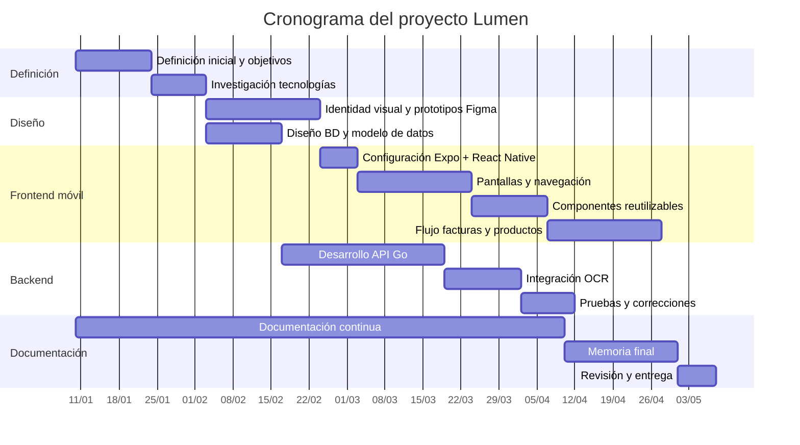
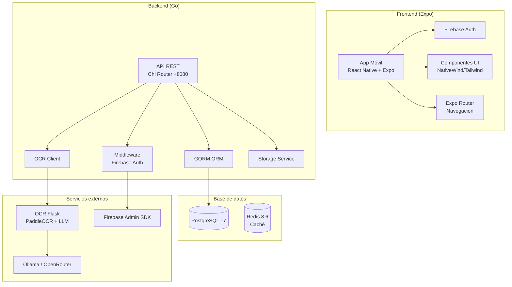

# 2. Planificación del proyecto

La planificación del proyecto se ha definido siguiendo una metodología ágil e iterativa. El trabajo se ha dividido en tareas concretas, revisiones periódicas y entregas parciales, lo que permite adaptar prioridades a medida que avanza el desarrollo y se detectan nuevas necesidades.

Este enfoque resulta adecuado para un proyecto formado por varias partes técnicas: aplicación móvil, diseño de interfaz, backend, base de datos y procesamiento de tickets. La división por fases permite avanzar en paralelo en diseño, desarrollo y documentación, reduciendo el riesgo de concentrar todo el trabajo en una única fase final.

## 2.1. Temporización del proyecto

El proyecto se ha organizado en etapas secuenciales e iterativas. La planificación general contempla las siguientes fases:

1. Definición inicial del proyecto y objetivos.
2. Investigación de tecnologías para frontend móvil, backend, OCR e inteligencia artificial.
3. Diseño de identidad visual y prototipos en Figma.
4. Configuración del proyecto móvil con Expo y React Native.
5. Desarrollo de pantallas principales y navegación.
6. Implementación de componentes reutilizables.
7. Implementación de flujos de facturas, productos y revisión local.
8. Revisión y actualización de documentación.
9. Preparación de memoria final.
10. Revisión de backend, API, base de datos y despliegue.

La planificación ha seguido un enfoque incremental. En lugar de esperar a disponer de todo el sistema completo, se han desarrollado primero los flujos principales de la aplicación móvil con datos de demostración, captura de factura con cámara y revisión local en memoria. Esto permite validar la estructura de navegación y la experiencia de usuario antes de estabilizar backend, persistencia y servicios OCR/IA productivos.

## 2.2. Recursos y materiales

Para llevar a cabo el proyecto se han utilizado recursos propios de un entorno de desarrollo de software moderno.

**Hardware**

Se han utilizado equipos personales para el desarrollo, pruebas y documentación. Para fases posteriores del proyecto se contempla el uso de un VPS o entorno servidor para desplegar backend, base de datos y servicios auxiliares.

**Software y herramientas de desarrollo**

Las principales herramientas utilizadas o previstas son:

- Git y GitHub para control de versiones.
- Visual Studio Code u otros editores de código.
- Obsidian para organización de documentación.
- Figma para diseño de interfaz y prototipado.
- Expo para desarrollo móvil multiplataforma.
- npm para gestión de dependencias del frontend móvil.
- Mermaid para diagramas dentro de la documentación.

**Documentación y referencias**

Se han consultado documentaciones oficiales de las tecnologías utilizadas, especialmente Expo, React Native, Firebase, NativeWind, TypeScript y herramientas relacionadas con el desarrollo móvil.

## 2.3. Tecnologías escogidas para el desarrollo

La selección tecnológica se ha realizado teniendo en cuenta la compatibilidad entre componentes, la curva de aprendizaje, la documentación disponible y la posibilidad de desarrollar una aplicación móvil multiplataforma.

**Frontend móvil**

La aplicación móvil está desarrollada con React Native y Expo. React Native permite construir interfaces móviles usando React, mientras que Expo simplifica la configuración del entorno, la navegación, la carga de fuentes, los assets y la ejecución en Android, iOS o web.

**Navegación**

Se utiliza Expo Router, que organiza la navegación mediante archivos dentro de la carpeta `app/`. Esta decisión facilita relacionar cada pantalla con su ruta y simplifica la estructura general del proyecto.

**Estilos e interfaz**

La aplicación utiliza NativeWind y una configuración de Tailwind CSS adaptada a React Native. Los colores se centralizan en `src/constants/colors.js`, lo que permite mantener una paleta común entre diseño y código.

**Autenticación**

El login de la aplicación móvil se integra con Firebase Auth mediante email y contraseña. Esta integración permite validar el flujo de entrada a la aplicación, aunque en la memoria final conviene acompañarla de evidencias de prueba o credenciales de entorno si se quiere presentar como funcionalidad completamente verificada.

**Backend, base de datos, OCR e IA**

El backend del proyecto se desarrolla en Go, utilizando Chi como router HTTP, GORM como ORM y PostgreSQL como base de datos principal. La persistencia se define mediante modelos GORM y migraciones automáticas con `AutoMigrate`. El procesamiento de tickets se delega en un servicio OCR independiente desarrollado en Python con Flask, PaddleOCR y proveedores LLM configurables mediante Ollama u OpenRouter.

Esta separación permite que la aplicación móvil mantenga una experiencia centrada en el usuario mientras el backend concentra la autenticación, persistencia, cálculo de balance e integración con OCR.

