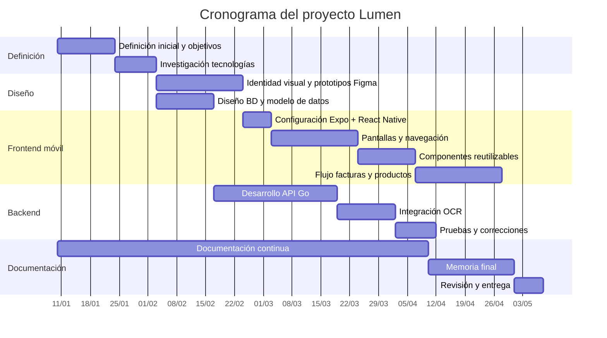

# 2.1. Temporización del proyecto

El proyecto se ha organizado en etapas secuenciales e iterativas. La planificación general contempla las siguientes fases:

1. Definición inicial del proyecto y objetivos.
2. Investigación de tecnologías para frontend móvil, backend, OCR e inteligencia artificial.
3. Diseño de identidad visual y prototipos en Figma.
4. Configuración del proyecto móvil con Expo y React Native.
5. Desarrollo de pantallas principales y navegación.
6. Implementación de componentes reutilizables.
7. Implementación de flujos de facturas, productos y revisión local.
8. Revisión y actualización de documentación.
9. Preparación de memoria final.
10. Revisión de backend, API, base de datos y despliegue.

La planificación ha seguido un enfoque incremental. En lugar de esperar a disponer de todo el sistema completo, se han desarrollado primero los flujos principales de la aplicación móvil con datos de demostración, captura de factura con cámara y revisión local en memoria. Esto permite validar la estructura de navegación y la experiencia de usuario antes de estabilizar backend, persistencia y servicios OCR/IA productivos.
