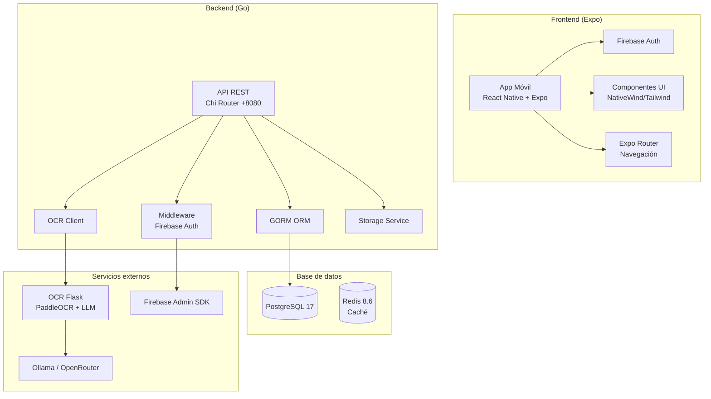

# 2.3. Tecnologías escogidas para el desarrollo

La selección tecnológica se ha realizado teniendo en cuenta la compatibilidad entre componentes, la curva de aprendizaje, la documentación disponible y la posibilidad de desarrollar una aplicación móvil multiplataforma.

**Frontend móvil**

La aplicación móvil está desarrollada con React Native y Expo. React Native permite construir interfaces móviles usando React, mientras que Expo simplifica la configuración del entorno, la navegación, la carga de fuentes, los assets y la ejecución en Android, iOS o web.

**Navegación**

Se utiliza Expo Router, que organiza la navegación mediante archivos dentro de la carpeta `app/`. Esta decisión facilita relacionar cada pantalla con su ruta y simplifica la estructura general del proyecto.

**Estilos e interfaz**

La aplicación utiliza NativeWind y una configuración de Tailwind CSS adaptada a React Native. Los colores se centralizan en `src/constants/colors.js`, lo que permite mantener una paleta común entre diseño y código.

**Autenticación**

El login de la aplicación móvil se integra con Firebase Auth mediante email y contraseña. Esta integración permite validar el flujo de entrada a la aplicación, aunque en la memoria final conviene acompañarla de evidencias de prueba o credenciales de entorno si se quiere presentar como funcionalidad completamente verificada.

**Backend, base de datos, OCR e IA**

El backend del proyecto se desarrolla en Go, utilizando Chi como router HTTP, GORM como ORM y PostgreSQL como base de datos principal. La persistencia se define mediante modelos GORM y migraciones automáticas con `AutoMigrate`. El procesamiento de tickets se delega en un servicio OCR independiente desarrollado en Python con Flask, PaddleOCR y proveedores LLM configurables mediante Ollama u OpenRouter.

Esta separación permite que la aplicación móvil mantenga una experiencia centrada en el usuario mientras el backend concentra la autenticación, persistencia, cálculo de balance e integración con OCR.

