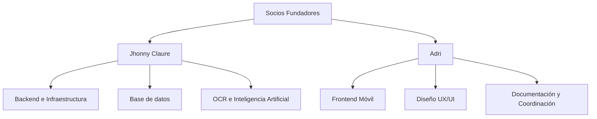

# 3.4. Organigrama y reparto de tareas

La empresa se organiza como una startup tecnológica de tamaño reducido. Los dos socios fundadores asumen distintas responsabilidades, pero colaboran en la toma de decisiones y en la evolución general del producto.

El reparto principal de tareas es el siguiente:

**Jhonny Claure: backend, infraestructura e IA**

- Desarrollo del backend y API.
- Diseño e implementación de base de datos.
- Gestión de infraestructura y despliegue.
- Integración de OCR e inteligencia artificial.
- Apoyo en pruebas técnicas y seguridad.

**Adri: frontend móvil y experiencia de usuario**

- Desarrollo de la aplicación móvil.
- Diseño UX/UI y adaptación del prototipo a código.
- Definición de estructura visual y componentes.
- Organización de documentación y planificación.
- Coordinación del proyecto y seguimiento de tareas.

Ambos integrantes colaboran en la documentación, revisión de decisiones técnicas y definición del alcance funcional del proyecto.
