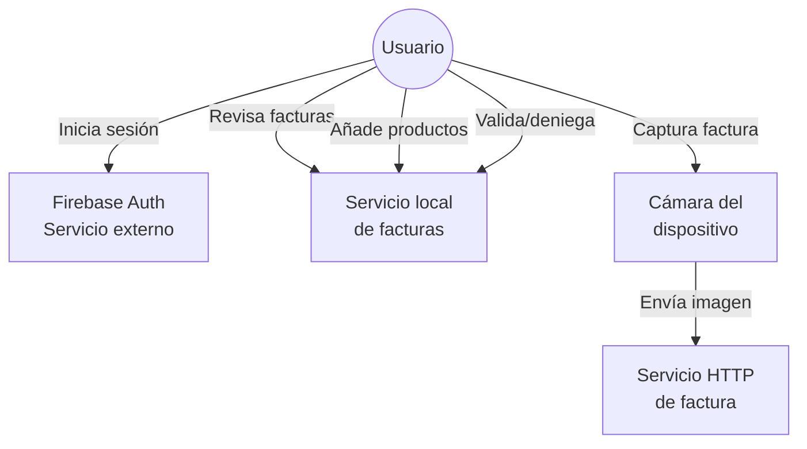
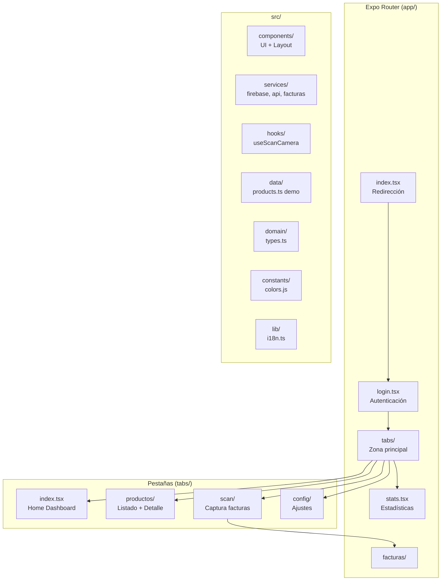
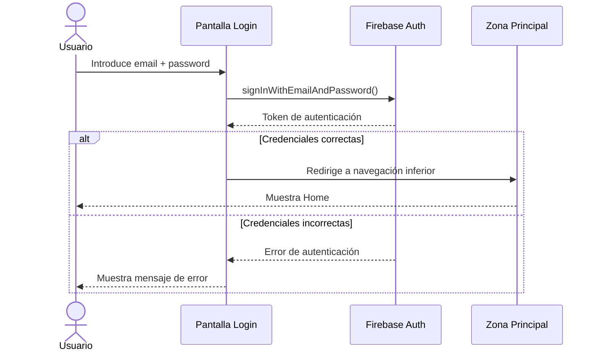
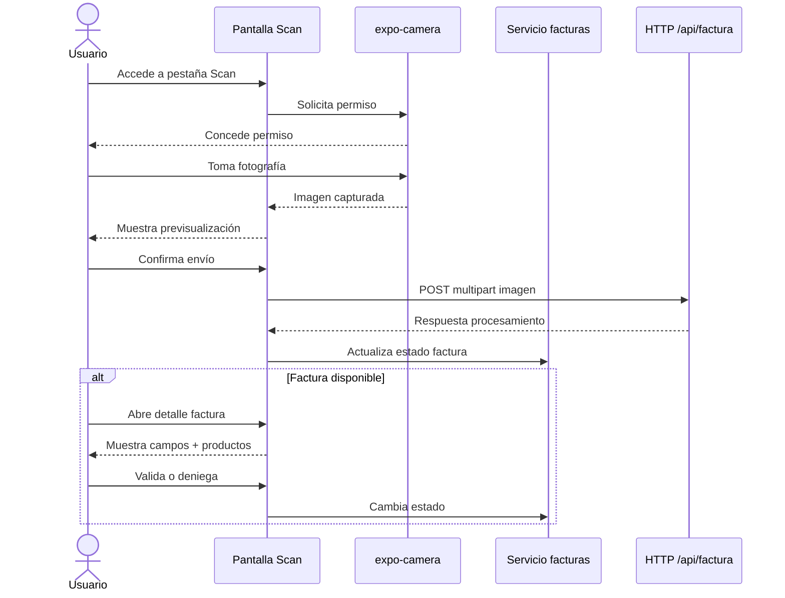
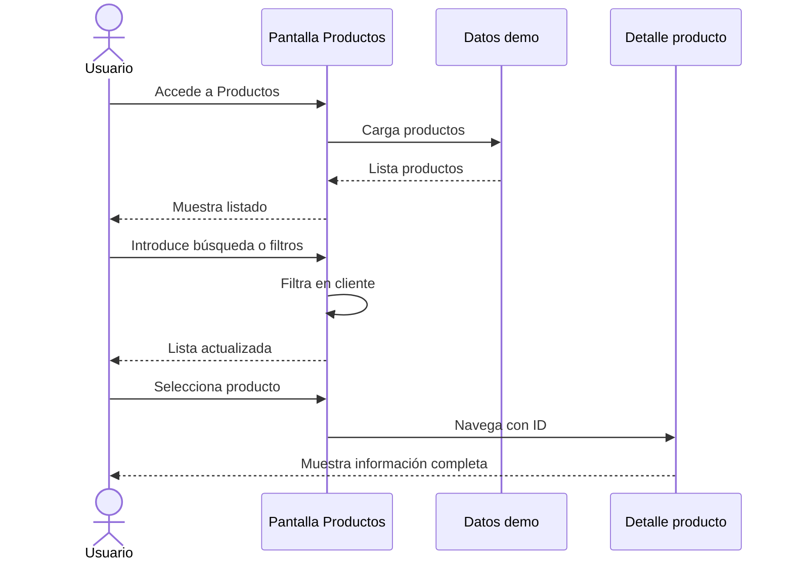
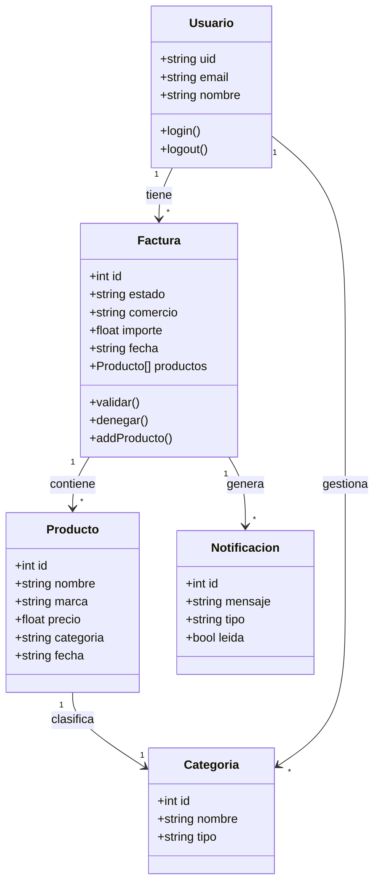
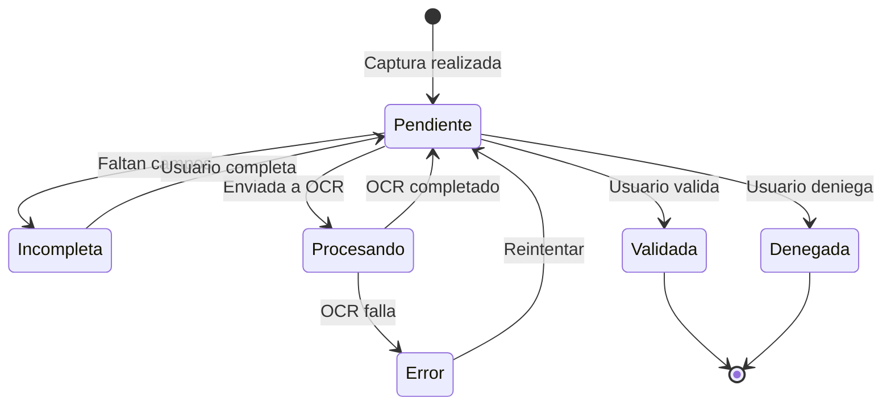

# 4.1. Especificación funcional del sistema

Lumen es una aplicación móvil de gestión financiera personal. La versión revisada se centra en la experiencia de usuario móvil y en la construcción de los principales flujos de navegación: acceso a la aplicación, consulta de resumen financiero, listado de productos, captura de facturas, revisión de facturas y configuración de preferencias.

El sistema está desarrollado con Expo y React Native, utilizando Expo Router para organizar la navegación mediante rutas basadas en archivos. La aplicación dispone de una navegación inferior con cuatro secciones principales: Home, Productos, Scan y Configuración. Además, incluye pantallas auxiliares para login, estadísticas, detalle de producto y detalle de factura.

En el estado actual, la app móvil implementa la interfaz principal y la lógica de interacción del prototipo. El login está integrado con Firebase Auth mediante `signInWithEmailAndPassword`; los productos se cargan desde datos estáticos; la captura de facturas utiliza `expo-camera` y envía la imagen a un endpoint HTTP; y el seguimiento/revisión de facturas se apoya en un servicio local en memoria para representar los estados de procesamiento.

## 4.1.1. Especificación del sistema propuesto

El sistema propuesto se organiza alrededor de la actividad del usuario y de sus gastos cotidianos. La aplicación debe permitir consultar información financiera, registrar productos, clasificar gastos y revisar facturas.

En la aplicación móvil actual, las funcionalidades verificadas son:

- Inicio de sesión con Firebase Auth.
- Navegación principal por pestañas.
- Dashboard con tarjetas resumen.
- Pantalla de estadísticas con métricas demostrativas.
- Listado y filtrado de productos.
- Detalle de producto.
- Captura de factura con cámara y envío HTTP de la imagen.
- Revisión de factura con campos detectados y productos asociados.
- Validación o denegación de facturas en memoria.
- Entrada manual de productos vinculados a una factura.
- Configuración básica de perfil y preferencias en estado local.

Las funcionalidades previstas pero no verificadas como implementación final son:

- Registro de nuevos usuarios.
- Recuperación de contraseña.
- Sincronización real con backend.
- Persistencia local offline.
- Respuesta OCR/IA productiva integrada en la revisión de factura.
- Exportación de datos.
- Gestión de presupuestos.
- Área de administración.
- Suscripciones o pagos.

## 4.1.1.1. Descripción de los actores

**Usuario de la aplicación**

Es el actor principal. Accede a la app, consulta información financiera, revisa productos, utiliza el flujo de captura de facturas, añade productos manualmente y modifica preferencias locales.

**Servicio de autenticación externo**

Firebase Auth se encarga de validar las credenciales introducidas en la pantalla de login.

**Servicio local de facturas**

El servicio `src/services/facturas.ts` gestiona en memoria el comportamiento esperado del procesamiento de facturas. Permite listar facturas, obtener una factura por identificador, simular el resultado de procesamiento, añadir productos manuales y cambiar el estado de una factura.

**Servicio HTTP de factura**

El hook `src/hooks/useScanCamera.tsx` usa `expo-camera` para tomar una fotografía y envía la imagen mediante `multipart/form-data` a `/api/factura`. En la versión revisada el endpoint aparece configurado con una URL local de red, por lo que debe ajustarse para cada entorno de ejecución.



## 4.1.1.2. Modelo de casos de uso

Los principales casos de uso de la aplicación móvil son:

| Caso de uso | Estado | Descripción |
| --- | --- | --- |
| Iniciar sesión | Implementado | El usuario accede mediante email y contraseña. |
| Consultar dashboard | Implementado con datos demo | Muestra tarjetas resumen y análisis. |
| Ver estadísticas | Implementado con datos demo | Presenta ingresos, beneficios y variación. |
| Listar productos | Implementado con datos demo | Muestra productos definidos en datos estáticos. |
| Buscar productos | Implementado | Permite buscar por nombre, marca, precio, categoría o fecha. |
| Filtrar productos | Implementado | Permite filtrar por categoría, marca y rango de precio. |
| Ver detalle de producto | Implementado | Muestra datos individuales de un producto. |
| Capturar y enviar factura | Implementado parcialmente | Solicita permiso de cámara, toma una imagen y la envía a un endpoint HTTP. |
| Revisar factura | Implementado con datos locales | Muestra campos detectados, productos y estado. |
| Validar o denegar factura | Implementado en memoria | Cambia el estado de la factura. |
| Añadir producto manual | Implementado en memoria | Vincula un producto a una factura existente. |
| Configurar perfil | Implementado localmente | Modifica datos dentro del estado de pantalla. |
| Cambiar preferencias | Implementado localmente | Cambia idioma y controles de preferencias. |
| Cerrar sesión | Implementado | Llama a Firebase Auth mediante `signOut` y redirige a login. |

```mermaid
graph TD
    USUARIO((Usuario))
    USUARIO --> CU_LOGIN[Iniciar sesión]
    USUARIO --> CU_DASH[Consultar dashboard]
    USUARIO --> CU_STATS[Ver estadísticas]
    USUARIO --> CU_LIST[Listar productos]
    USUARIO --> CU_SEARCH[Buscar productos]
    USUARIO --> CU_FILTER[Filtrar productos]
    USUARIO --> CU_DETAIL[Ver detalle producto]
    USUARIO --> CU_SCAN[Capturar y enviar factura]
    USUARIO --> CU_REVIEW[Revisar factura]
    USUARIO --> CU_VALIDATE[Validar o denegar factura]
    USUARIO --> CU_ADD[Añadir producto manual]
    USUARIO --> CU_PROFILE[Configurar perfil]
    USUARIO --> CU_PREFS[Cambiar preferencias]
    USUARIO --> CU_LOGOUT[Cerrar sesión]

    CU_LOGIN -->|depende de| AUTH[Firebase Auth]
    CU_SCAN -->|usa| CAMARA[Cámara dispositivo]
    CU_SCAN -->|envía a| F_ENDPOINT[/api/factura]
```

## 4.1.2. Diseño del sistema

El diseño del sistema se apoya en una separación entre rutas, componentes reutilizables, servicios, datos estáticos, constantes y assets. La carpeta `app/` contiene las pantallas gestionadas por Expo Router, mientras que `src/` agrupa componentes, servicios, dominio, assets y constantes.



## 4.1.2.1. Diagramas de secuencia de los casos de uso más relevantes

**Flujo de inicio de sesión**

1. El usuario introduce email y contraseña.
2. La pantalla de login llama a Firebase Auth.
3. Firebase valida las credenciales.
4. Si la autenticación es correcta, la app redirige a la zona principal.
5. Si falla, se muestra un mensaje de error.



**Flujo de captura y revisión de factura**

1. El usuario accede a la pestaña Scan.
2. Selecciona el modo foto.
3. Si no hay permiso de cámara, la app solicita autorización al usuario.
4. La app abre la cámara y permite tomar una fotografía.
5. El usuario revisa la previsualización capturada y confirma el envío.
6. La imagen se envía mediante `multipart/form-data` a `/api/factura`.
7. La interfaz actualiza el estado de factura con el servicio local en memoria.
8. Si existe factura, el usuario puede abrir el detalle.
9. En el detalle, puede validar o denegar la factura.



**Flujo de filtrado de productos**

1. El usuario accede a Productos.
2. La app carga productos de demostración.
3. El usuario aplica filtros o búsqueda.
4. La lista se recalcula en cliente.
5. El usuario puede abrir el detalle de un producto.



## 4.1.2.2. Diagrama de clases de diseño

Desde el frontend revisado se identifican las siguientes entidades funcionales:

- Producto o gasto registrado.
- Factura.
- Campo detectado de factura.
- Línea de producto de factura.
- Notificación de factura.
- Usuario autenticado.



## 4.1.2.3. Diagramas de estado

El caso más representativo es el estado de una factura dentro del flujo de revisión. Una factura puede estar pendiente de revisión, incompleta, validada, denegada o en error.



## 4.1.3. Interfaces de usuario: mapa de formularios

El mapa de pantallas actual es:

| Pantalla | Ruta | Función |
| --- | --- | --- |
| Entrada inicial | `app/index.tsx` | Redirección inicial. |
| Login | `app/login.tsx` | Autenticación. |
| Home | `app/(tabs)/index.tsx` | Resumen financiero. |
| Productos | `app/(tabs)/productos/index.tsx` | Listado y filtros. |
| Detalle de producto | `app/(tabs)/productos/[id].tsx` | Información individual. |
| Scan | `app/(tabs)/scan/index.tsx` | Captura de factura y entrada manual. |
| Detalle de factura | `app/facturas/[id].tsx` | Revisión y validación. |
| Stats | `app/stats.tsx` | Estadísticas. |
| Configuración | `app/(tabs)/config/index.tsx` | Opciones de usuario. |
| Perfil | `app/(tabs)/config/perfil.tsx` | Edición local de perfil. |
| Preferencias | `app/(tabs)/config/preferencias.tsx` | Idioma, moneda y tema. |
| Notificaciones | `app/(tabs)/config/notificaciones.tsx` | Interruptores locales de recordatorios, resumen y push. |
| Categorías | `app/(tabs)/config/categorias.tsx` | Pantalla base de categorías. |
| Datos | `app/(tabs)/config/datos.tsx` | Acciones de importar, sincronizar y exportar pendientes de CSV. |
| Información | `app/(tabs)/config/informacion.tsx` | Información de la aplicación. |

```mermaid
graph TD
    INDEX[index.tsx<br/>Redirección]
    LOGIN[login.tsx<br/>Login Firebase]
    TABS[tabs/_layout.tsx<br/>Navegación inferior]
    HOME[index.tsx<br/>Home]
    PROD[productos/index.tsx<br/>Listado productos]
    PROD_DET[productos/[id].tsx<br/>Detalle producto]
    SCAN[scan/index.tsx<br/>Captura factura]
    FACTURA[facturas/[id].tsx<br/>Detalle factura]
    STATS[stats.tsx<br/>Estadísticas]
    CONFIG[config/index.tsx<br/>Menú configuración]
    PERFIL[config/perfil.tsx<br/>Perfil]
    PREF[config/preferencias.tsx<br/>Preferencias]
    NOTIF[config/notificaciones.tsx<br/>Notificaciones]
    CAT[config/categorias.tsx<br/>Categorías]
    DATOS[config/datos.tsx<br/>Datos]
    INFO[config/informacion.tsx<br/>Información]

    INDEX --> LOGIN
    LOGIN --> TABS
    TABS --> HOME
    TABS --> PROD
    TABS --> SCAN
    TABS --> CONFIG
    TABS --> STATS
    PROD --> PROD_DET
    SCAN --> FACTURA
    CONFIG --> PERFIL
    CONFIG --> PREF
    CONFIG --> NOTIF
    CONFIG --> CAT
    CONFIG --> DATOS
    CONFIG --> INFO
```
