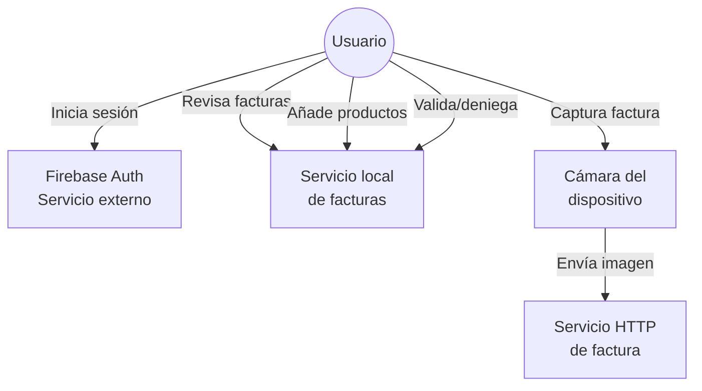

# 4.1.1. Especificación del sistema propuesto

El sistema propuesto se organiza alrededor de la actividad del usuario y de sus gastos cotidianos. La aplicación debe permitir consultar información financiera, registrar productos, clasificar gastos y revisar facturas.

En la aplicación móvil actual, las funcionalidades verificadas son:

- Inicio de sesión con Firebase Auth.
- Navegación principal por pestañas.
- Dashboard con tarjetas resumen.
- Pantalla de estadísticas con métricas demostrativas.
- Listado y filtrado de productos.
- Detalle de producto.
- Captura de factura con cámara y envío HTTP de la imagen.
- Revisión de factura con campos detectados y productos asociados.
- Validación o denegación de facturas en memoria.
- Entrada manual de productos vinculados a una factura.
- Configuración básica de perfil y preferencias en estado local.

Las funcionalidades previstas pero no verificadas como implementación final son:

- Registro de nuevos usuarios.
- Recuperación de contraseña.
- Sincronización real con backend.
- Persistencia local offline.
- Respuesta OCR/IA productiva integrada en la revisión de factura.
- Exportación de datos.
- Gestión de presupuestos.
- Área de administración.
- Suscripciones o pagos.

## 4.1.1.1. Descripción de los actores

**Usuario de la aplicación**

Es el actor principal. Accede a la app, consulta información financiera, revisa productos, utiliza el flujo de captura de facturas, añade productos manualmente y modifica preferencias locales.

**Servicio de autenticación externo**

Firebase Auth se encarga de validar las credenciales introducidas en la pantalla de login.

**Servicio local de facturas**

El servicio `src/services/facturas.ts` gestiona en memoria el comportamiento esperado del procesamiento de facturas. Permite listar facturas, obtener una factura por identificador, simular el resultado de procesamiento, añadir productos manuales y cambiar el estado de una factura.

**Servicio HTTP de factura**

El hook `src/hooks/useScanCamera.tsx` usa `expo-camera` para tomar una fotografía y envía la imagen mediante `multipart/form-data` a `/api/factura`. En la versión revisada el endpoint aparece configurado con una URL local de red, por lo que debe ajustarse para cada entorno de ejecución.



## 4.1.1.2. Modelo de casos de uso

Los principales casos de uso de la aplicación móvil son:

| Caso de uso | Estado | Descripción |
| --- | --- | --- |
| Iniciar sesión | Implementado | El usuario accede mediante email y contraseña. |
| Consultar dashboard | Implementado con datos demo | Muestra tarjetas resumen y análisis. |
| Ver estadísticas | Implementado con datos demo | Presenta ingresos, beneficios y variación. |
| Listar productos | Implementado con datos demo | Muestra productos definidos en datos estáticos. |
| Buscar productos | Implementado | Permite buscar por nombre, marca, precio, categoría o fecha. |
| Filtrar productos | Implementado | Permite filtrar por categoría, marca y rango de precio. |
| Ver detalle de producto | Implementado | Muestra datos individuales de un producto. |
| Capturar y enviar factura | Implementado parcialmente | Solicita permiso de cámara, toma una imagen y la envía a un endpoint HTTP. |
| Revisar factura | Implementado con datos locales | Muestra campos detectados, productos y estado. |
| Validar o denegar factura | Implementado en memoria | Cambia el estado de la factura. |
| Añadir producto manual | Implementado en memoria | Vincula un producto a una factura existente. |
| Configurar perfil | Implementado localmente | Modifica datos dentro del estado de pantalla. |
| Cambiar preferencias | Implementado localmente | Cambia idioma y controles de preferencias. |
| Cerrar sesión | Implementado | Llama a Firebase Auth mediante `signOut` y redirige a login. |

```mermaid
graph TD
    USUARIO((Usuario))
    USUARIO --> CU_LOGIN[Iniciar sesión]
    USUARIO --> CU_DASH[Consultar dashboard]
    USUARIO --> CU_STATS[Ver estadísticas]
    USUARIO --> CU_LIST[Listar productos]
    USUARIO --> CU_SEARCH[Buscar productos]
    USUARIO --> CU_FILTER[Filtrar productos]
    USUARIO --> CU_DETAIL[Ver detalle producto]
    USUARIO --> CU_SCAN[Capturar y enviar factura]
    USUARIO --> CU_REVIEW[Revisar factura]
    USUARIO --> CU_VALIDATE[Validar o denegar factura]
    USUARIO --> CU_ADD[Añadir producto manual]
    USUARIO --> CU_PROFILE[Configurar perfil]
    USUARIO --> CU_PREFS[Cambiar preferencias]
    USUARIO --> CU_LOGOUT[Cerrar sesión]

    CU_LOGIN -->|depende de| AUTH[Firebase Auth]
    CU_SCAN -->|usa| CAMARA[Cámara dispositivo]
    CU_SCAN -->|envía a| F_ENDPOINT[/api/factura]
```
