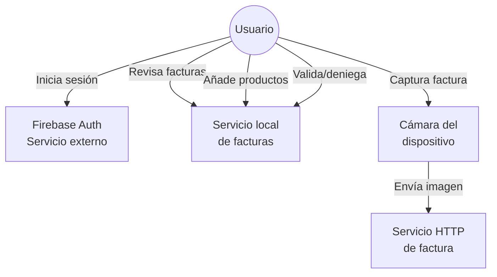

# 4.1.1.1. Descripción de los actores

**Usuario de la aplicación**

Es el actor principal. Accede a la app, consulta información financiera, revisa productos, utiliza el flujo de captura de facturas, añade productos manualmente y modifica preferencias locales.

**Servicio de autenticación externo**

Firebase Auth se encarga de validar las credenciales introducidas en la pantalla de login.

**Servicio local de facturas**

El servicio `src/services/facturas.ts` gestiona en memoria el comportamiento esperado del procesamiento de facturas. Permite listar facturas, obtener una factura por identificador, simular el resultado de procesamiento, añadir productos manuales y cambiar el estado de una factura.

**Servicio HTTP de factura**

El hook `src/hooks/useScanCamera.tsx` usa `expo-camera` para tomar una fotografía y envía la imagen mediante `multipart/form-data` a `/api/factura`. En la versión revisada el endpoint aparece configurado con una URL local de red, por lo que debe ajustarse para cada entorno de ejecución.

