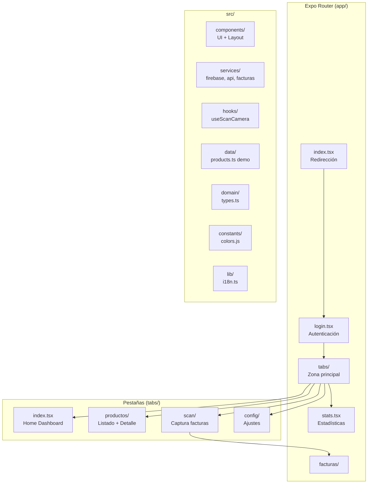
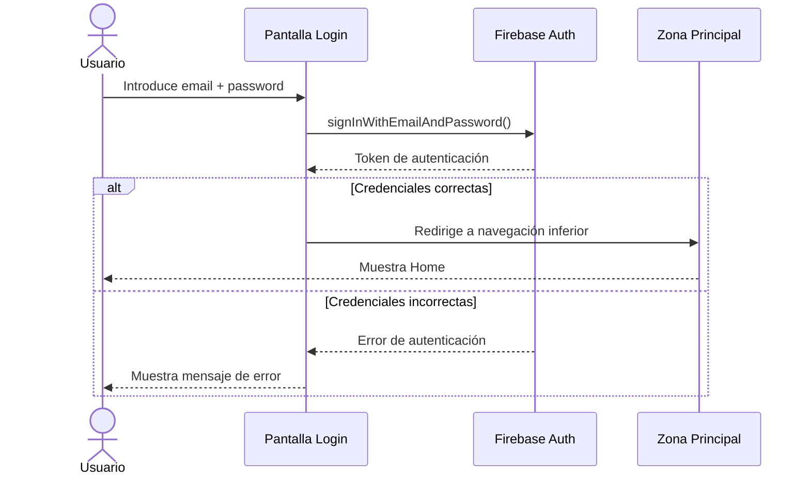
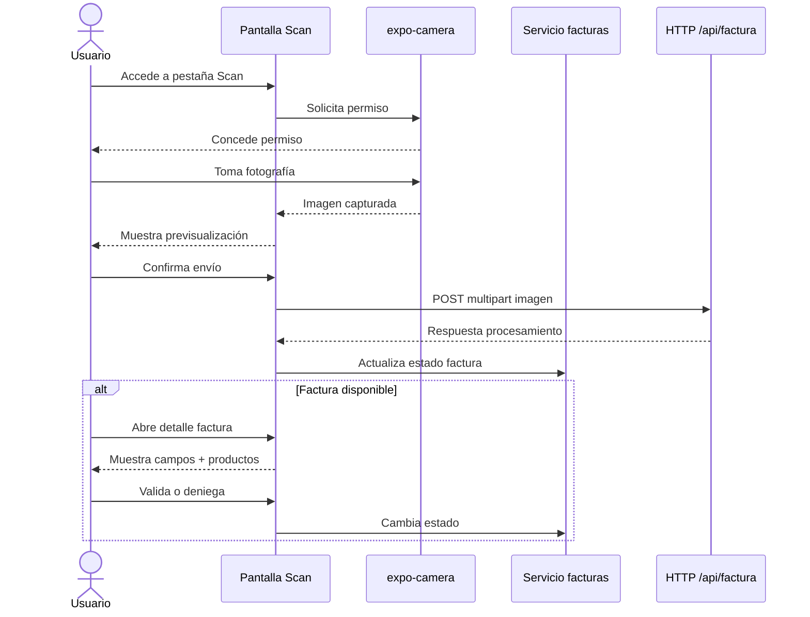
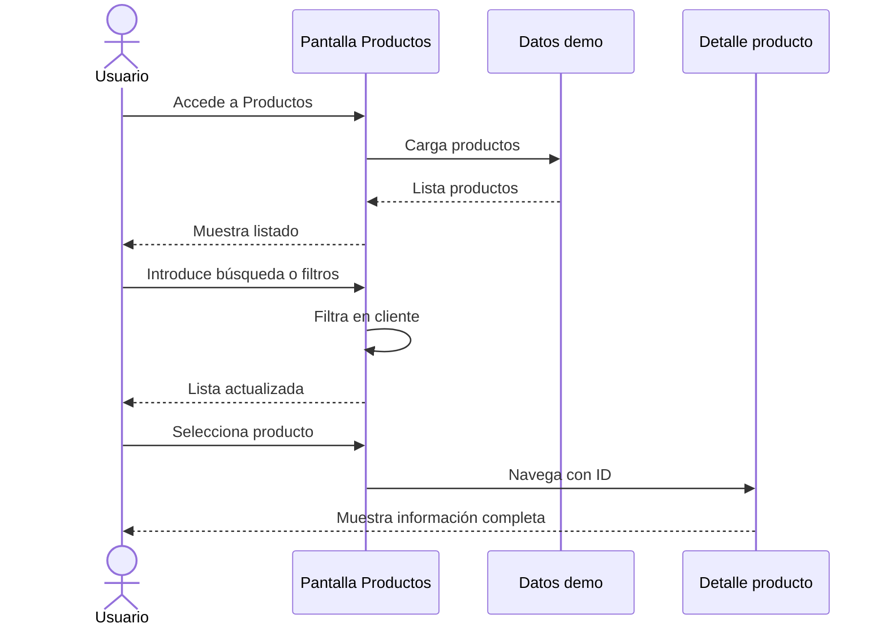
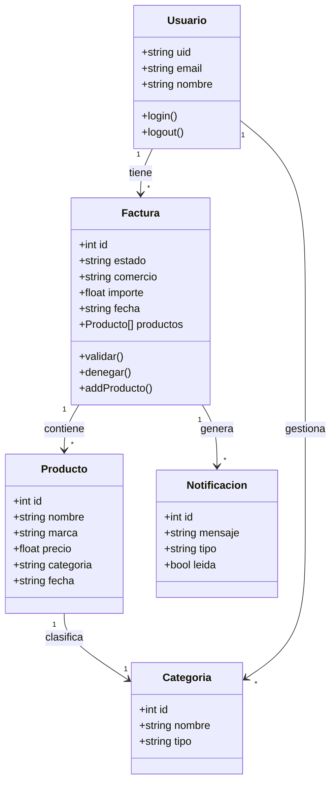
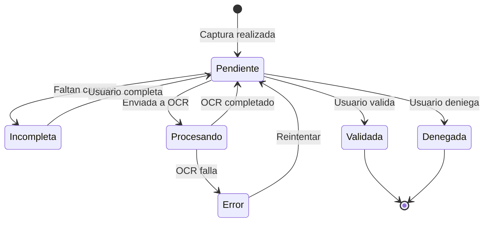

# 4.1.2. Diseño del sistema

El diseño del sistema se apoya en una separación entre rutas, componentes reutilizables, servicios, datos estáticos, constantes y assets. La carpeta `app/` contiene las pantallas gestionadas por Expo Router, mientras que `src/` agrupa componentes, servicios, dominio, assets y constantes.

## 4.1.2.1. Diagramas de secuencia de los casos de uso más relevantes

**Flujo de inicio de sesión**

1. El usuario introduce email y contraseña.
2. La pantalla de login llama a Firebase Auth.
3. Firebase valida las credenciales.
4. Si la autenticación es correcta, la app redirige a la zona principal.
5. Si falla, se muestra un mensaje de error.

**Flujo de captura y revisión de factura**

1. El usuario accede a la pestaña Scan.
2. Selecciona el modo foto.
3. Si no hay permiso de cámara, la app solicita autorización al usuario.
4. La app abre la cámara y permite tomar una fotografía.
5. El usuario revisa la previsualización capturada y confirma el envío.
6. La imagen se envía mediante `multipart/form-data` a `/api/factura`.
7. La interfaz actualiza el estado de factura con el servicio local en memoria.
8. Si existe factura, el usuario puede abrir el detalle.
9. En el detalle, puede validar o denegar la factura.

**Flujo de filtrado de productos**

1. El usuario accede a Productos.
2. La app carga productos de demostración.
3. El usuario aplica filtros o búsqueda.
4. La lista se recalcula en cliente.
5. El usuario puede abrir el detalle de un producto.

## 4.1.2.2. Diagrama de clases de diseño

Desde el frontend revisado se identifican las siguientes entidades funcionales:

- Producto o gasto registrado.
- Factura.
- Campo detectado de factura.
- Línea de producto de factura.
- Notificación de factura.
- Usuario autenticado.

## 4.1.2.3. Diagramas de estado

El caso más representativo es el estado de una factura dentro del flujo de revisión. Una factura puede estar pendiente de revisión, incompleta, validada, denegada o en error.

