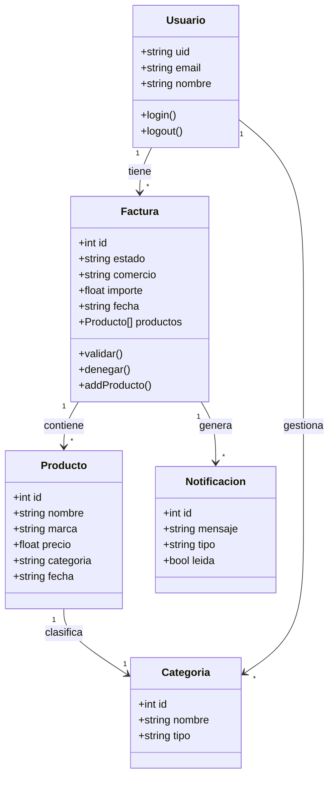

# 4.1.2.2. Diagrama de clases de diseño

Desde el frontend revisado se identifican las siguientes entidades funcionales:

- Producto o gasto registrado.
- Factura.
- Campo detectado de factura.
- Línea de producto de factura.
- Notificación de factura.
- Usuario autenticado.

