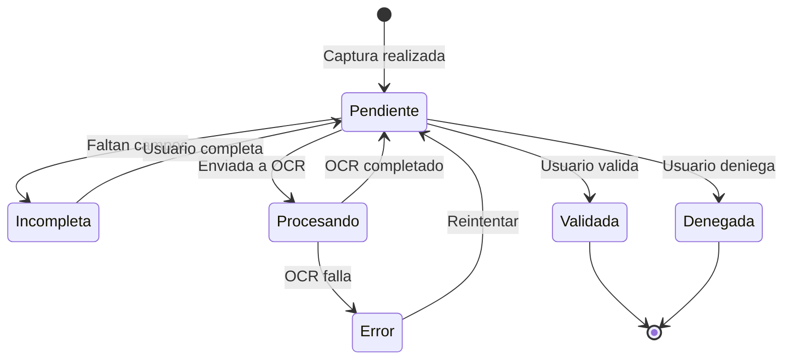

# 4.1.2.3. Diagramas de estado

El caso más representativo es el estado de una factura dentro del flujo de revisión. Una factura puede estar pendiente de revisión, incompleta, validada, denegada o en error.

