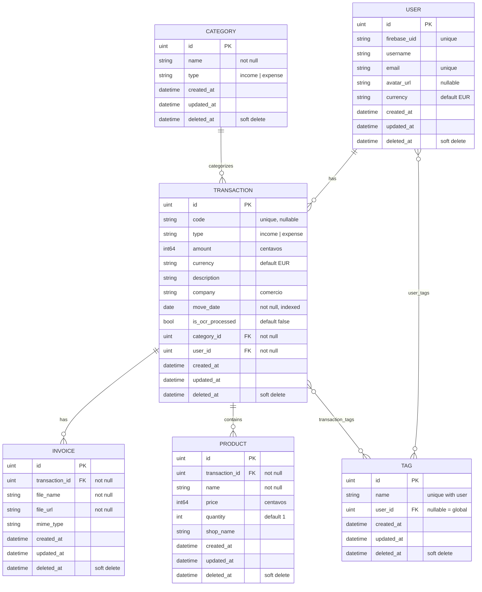

# 4.2. Bases de datos

La base de datos del sistema es relacional y está gestionada mediante **PostgreSQL 17** con **GORM** como ORM. El esquema se define mediante los modelos GORM y se aplica automáticamente mediante `AutoMigrate` al iniciar el backend. No se utiliza `init.sql`: la fuente de verdad es el código.

> La aplicación móvil no dispone de base de datos local. Trabaja con datos de demostración estáticos y stores en memoria. Toda la persistencia real recae en el backend Go con PostgreSQL.

## 4.2.1. Modelo Entidad-Relación (E/R)

## 4.2.2. Esquema lógico normalizado (3FN)

### Tablas principales

#### `users`

Almacena los usuarios del sistema. Se autentican mediante Firebase Auth y se identifican por `firebase_uid`.

| Columna | Tipo | Restricciones | Descripción |
|---------|------|---------------|-------------|
| `id` | `uint` | PK, auto-incremento | Identificador único |
| `firebase_uid` | `varchar(128)` | Unique, not null, indexed | UID de Firebase Auth |
| `username` | `varchar(50)` | | Nombre de usuario visible |
| `email` | `varchar(255)` | Unique, not null, indexed | Correo electrónico |
| `avatar_url` | `text` | Nullable | URL del avatar |
| `currency` | `char(3)` | Default: `'EUR'` | Moneda preferida del usuario |
| `created_at` | `timestamp` | Not null | Fecha de creación |
| `updated_at` | `timestamp` | Not null | Fecha de actualización |
| `deleted_at` | `timestamp` | Nullable (soft delete) | Fecha de borrado lógico |

#### `categories`

Clasificación de los movimientos financieros en dos tipos: ingresos y gastos.

| Columna | Tipo | Restricciones | Descripción |
|---------|------|---------------|-------------|
| `id` | `uint` | PK, auto-incremento | Identificador único |
| `name` | `varchar(100)` | Not null | Nombre visible (ej. "Alimentación") |
| `type` | `varchar(20)` | Not null, check: `IN ('income', 'expense')` | Tipo de categoría |
| `created_at` | `timestamp` | Not null | |
| `updated_at` | `timestamp` | Not null | |
| `deleted_at` | `timestamp` | Nullable (soft delete) | |

#### `tags`

Etiquetas universales o por usuario que permiten clasificar transacciones con criterios adicionales.

| Columna | Tipo | Restricciones | Descripción |
|---------|------|---------------|-------------|
| `id` | `uint` | PK, auto-incremento | Identificador único |
| `name` | `varchar(50)` | Not null, unique (con user_id) | Nombre de la etiqueta |
| `user_id` | `uint` | Nullable, FK → users.id | Null = tag global |
| `created_at` | `timestamp` | Not null | |
| `updated_at` | `timestamp` | Not null | |
| `deleted_at` | `timestamp` | Nullable (soft delete) | |

#### `transactions`

Entidad principal del dominio. Representa cada movimiento financiero registrado.

| Columna | Tipo | Restricciones | Descripción |
|---------|------|---------------|-------------|
| `id` | `uint` | PK, auto-incremento | Identificador único |
| `code` | `varchar(100)` | Unique, nullable | Código del ticket o factura |
| `type` | `varchar(20)` | Not null, check: `IN ('income', 'expense')` | Tipo de movimiento |
| `amount` | `int64` | Not null, default: 0 | Importe en **céntimos** |
| `currency` | `char(3)` | Default: `'EUR'` | Moneda |
| `description` | `text` | | Descripción libre |
| `company` | `varchar(255)` | | Nombre del comercio (ej. "Mercadona") |
| `move_date` | `date` | Not null, default: current_date, indexed | Fecha del movimiento |
| `is_ocr_processed` | `bool` | Default: false | Indica si se procesó con OCR |
| `category_id` | `uint` | Not null, FK → categories.id | Categoría del movimiento |
| `user_id` | `uint` | Not null, FK → users.id | Propietario de la transacción |
| `created_at` | `timestamp` | Not null | |
| `updated_at` | `timestamp` | Not null | |
| `deleted_at` | `timestamp` | Nullable (soft delete) | |

> **Importe en céntimos:** El campo `amount` usa el tipo `Money` (int64) para evitar errores de redondeo con punto flotante. Un valor de 1500 representa 15,00 €.

#### `invoices`

Facturas o tickets asociados a una transacción. Almacenan la imagen del ticket original.

| Columna | Tipo | Restricciones | Descripción |
|---------|------|---------------|-------------|
| `id` | `uint` | PK, auto-incremento | |
| `transaction_id` | `uint` | Not null, FK → transactions.id | Transacción asociada |
| `file_name` | `varchar(255)` | Not null | Nombre original del archivo |
| `file_url` | `text` | Not null | Ruta relativa en disco |
| `mime_type` | `varchar(100)` | | Tipo MIME del archivo |
| `created_at` | `timestamp` | Not null | |
| `updated_at` | `timestamp` | Not null | |
| `deleted_at` | `timestamp` | Nullable (soft delete) | |

#### `products`

Líneas de producto extraídas de una factura. Se generan automáticamente mediante el flujo OCR o se añaden manualmente.

| Columna | Tipo | Restricciones | Descripción |
|---------|------|---------------|-------------|
| `id` | `uint` | PK, auto-incremento | |
| `transaction_id` | `uint` | Not null, FK → transactions.id | Transacción asociada |
| `name` | `varchar(255)` | Not null | Nombre del producto |
| `price` | `int64` | Not null | Precio en céntimos |
| `quantity` | `int` | Not null, default: 1 | Cantidad |
| `shop_name` | `varchar(255)` | | Nombre del comercio |
| `created_at` | `timestamp` | Not null | |
| `updated_at` | `timestamp` | Not null | |
| `deleted_at` | `timestamp` | Nullable (soft delete) | |

### Tablas pivote (many-to-many)

#### `user_tags`

Asocia usuarios con tags. Un usuario puede tener muchas tags; una tag puede pertenecer a muchos usuarios.

| Columna | Tipo | Restricciones |
|---------|------|---------------|
| `user_id` | `uint` | FK → users.id |
| `tag_id` | `uint` | FK → tags.id |

**Clave primaria:** compuesta `(user_id, tag_id)`.

#### `transaction_tags`

Asocia transacciones con tags. Una transacción puede tener muchas tags; una tag puede aparecer en muchas transacciones.

| Columna | Tipo | Restricciones |
|---------|------|---------------|
| `transaction_id` | `uint` | FK → transactions.id |
| `tag_id` | `uint` | FK → tags.id |

**Clave primaria:** compuesta `(transaction_id, tag_id)`.

### Resumen de relaciones

| Relación | Tipo | Descripción |
|----------|------|-------------|
| User → Transaction | 1:N | Un usuario tiene muchas transacciones |
| User → Tag | M:N | Tabla pivote `user_tags` |
| Category → Transaction | 1:N | Una categoría clasifica muchas transacciones |
| Transaction → Invoice | 1:N | Una transacción tiene varias facturas |
| Transaction → Product | 1:N | Una transacción contiene varios productos |
| Transaction → Tag | M:N | Tabla pivote `transaction_tags` |

### Integridad referencial

| Restricción | Regla |
|-------------|-------|
| `transactions.category_id` → `categories.id` | `ON UPDATE CASCADE`, `ON DELETE RESTRICT` |
| `transactions.user_id` → `users.id` | `ON UPDATE CASCADE`, `ON DELETE RESTRICT` |
| `invoices.transaction_id` → `transactions.id` | Borrado en cascada mediante hook `AfterDelete` de GORM |
| `products.transaction_id` → `transactions.id` | Borrado en cascada mediante hook `AfterDelete` de GORM |

### Notas sobre GORM

- **Soft delete:** Todas las entidades usan `gorm.Model`, que incluye `DeletedAt`. Las consultas estándar excluyen automáticamente los registros borrados.
- **AutoMigrate:** Al arrancar, el backend ejecuta `db.AutoMigrate(User, Category, Tag, Transaction, Invoice, Product)`. Crea tablas, añade columnas faltantes y crea índices. No elimina columnas ni tablas existentes.
- **Hook AfterDelete:** Al eliminar una transacción, GORM ejecuta un hook que borra en cascada las facturas y productos asociados.
