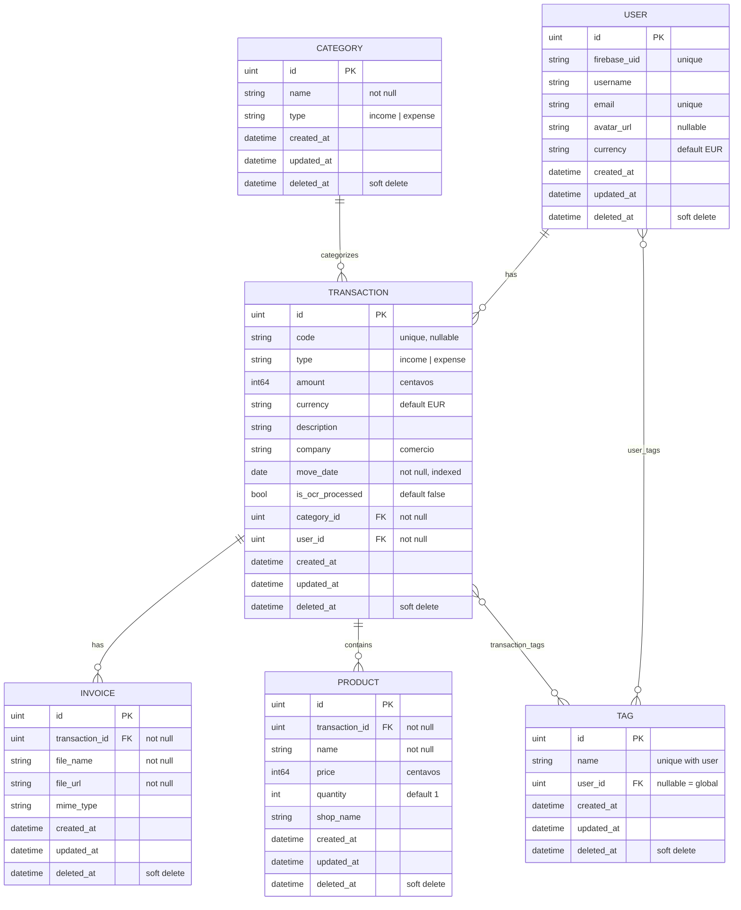

# 4.2.1. Modelo Entidad-Relación (E/R)

```mermaid
erDiagram
    USER ||--o{ TRANSACTION : "has"
    USER }o--o{ TAG : "user_tags"
    CATEGORY ||--o{ TRANSACTION : "categorizes"
    TRANSACTION ||--o{ INVOICE : "has"
    TRANSACTION ||--o{ PRODUCT : "contains"
    TRANSACTION }o--o{ TAG : "transaction_tags"

    USER {
        uint id PK
        string firebase_uid "unique"
        string username
        string email "unique"
        string avatar_url "nullable"
        string currency "default EUR"
        datetime created_at
        datetime updated_at
        datetime deleted_at "soft delete"
    }

    CATEGORY {
        uint id PK
        string name "not null"
        string type "income | expense"
        datetime created_at
        datetime updated_at
        datetime deleted_at "soft delete"
    }

    TAG {
        uint id PK
        string name "unique with user"
        uint user_id FK "nullable = global"
        datetime created_at
        datetime updated_at
        datetime deleted_at "soft delete"
    }

    TRANSACTION {
        uint id PK
        string code "unique, nullable"
        string type "income | expense"
        int64 amount "centavos"
        string currency "default EUR"
        string description
        string company "comercio"
        date move_date "not null, indexed"
        bool is_ocr_processed "default false"
        uint category_id FK "not null"
        uint user_id FK "not null"
        datetime created_at
        datetime updated_at
        datetime deleted_at "soft delete"
    }

    INVOICE {
        uint id PK
        uint transaction_id FK "not null"
        string file_name "not null"
        string file_url "not null"
        string mime_type
        datetime created_at
        datetime updated_at
        datetime deleted_at "soft delete"
    }

    PRODUCT {
        uint id PK
        uint transaction_id FK "not null"
        string name "not null"
        int64 price "centavos"
        int quantity "default 1"
        string shop_name
        datetime created_at
        datetime updated_at
        datetime deleted_at "soft delete"
    }
```
