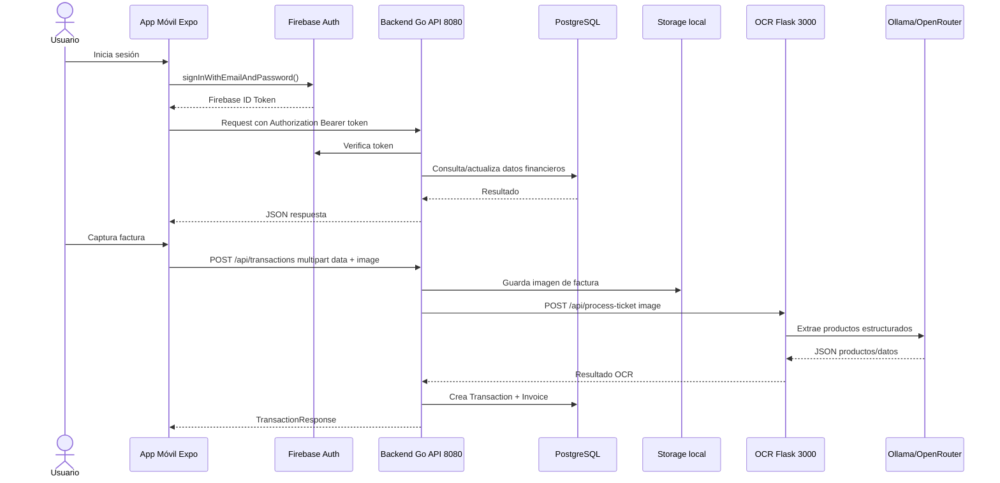

# 9. Documentación API

El proyecto expone **tres interfaces de comunicación** que se relacionan entre sí:

1. **API Backend Go** (puerto `8080`) — API financiera principal: autenticación, transacciones, categorías, tags, balance e integración con OCR para facturas.
2. **API OCR Flask** (puerto `3000`) — Servicio independiente de reconocimiento óptico de caracteres y extracción de productos mediante IA.
3. **Contrato provisional móvil `/api/factura`** — Llamada usada por la app móvil para escaneo de facturas. En el código actual apunta a una IP local en el puerto `3000`, pero no coincide con las rutas reales del servicio OCR (`/api/process-ticket`) ni con el contrato definitivo del backend Go (`/api/transactions`).

La arquitectura de comunicación del sistema es:

```
App Móvil (Expo)
    │
    ├── POST /api/auth/login ───────────────► Backend Go (8080)
    ├── GET/POST /api/transactions ─────────► Backend Go (8080)
    ├── GET/POST/PUT/DELETE /api/categories ─► Backend Go (8080)
    ├── GET/POST/PUT/DELETE /api/tags ───────► Backend Go (8080)
    ├── GET /api/balance ───────────────────► Backend Go (8080)
    │
    └── POST /api/transactions (multipart) ──► Backend Go (8080)
            └─ data (JSON)                        │
            └─ image (JPEG/PNG)                   └── POST /api/process-ticket ──► OCR (3000)
```



> **Nota sobre `/api/factura`:** La app móvil envía actualmente las imágenes a `http://10.196.17.218:3000/api/factura` con el campo `factura`. El servicio OCR real expone `/api/process-ticket` y espera el campo `image`; el backend Go expone `POST /api/transactions` con `data`, `image` y `process_ocr`. Queda pendiente alinear la app móvil con una de esas rutas reales, preferiblemente el backend Go autenticado.

---

## 9.1 Backend Go — API Financiera

**Tecnología:** Go 1.25, router Chi v5, GORM, PostgreSQL, Firebase Admin SDK.  
**Puerto:** `8080`

**Última actualización:** Se ha añadido integración con OCR, almacenamiento local de facturas, nuevo campo `company` y flag `is_ocr_processed` en transacciones. Se ha eliminado `database/init.sql` en favor de `AutoMigrate` de GORM como fuente de verdad para el esquema.

### 9.1.1 Autenticación

La autenticación se realiza mediante Firebase Auth. El backend acepta dos modos:

- **Token de Firebase real**: verificado mediante Firebase Admin SDK (`VerifyIDToken`).
- **Token de prueba**: si el token es exactamente `"test-admin-uid"`, el middleware genera un usuario simulado sin necesidad de Firebase real.

El middleware extrae el token de la cabecera `Authorization: Bearer <token>` e inyecta en el contexto un objeto `FirebaseClaims` con `UserID`, `UID`, `Email` y `FirebaseUID`.

### 9.1.2 Endpoints

---

#### `GET /` — Health Check

Devuelve un texto plano de bienvenida. No requiere autenticación.

| Detalle | Valor |
|---------|-------|
| Autenticación | No |
| Respuesta 200 | `"API de Gestión de Finanzas Personales"` |

---

#### `POST /api/auth/login` — Login de prueba

Permite obtener un token de prueba para desarrollo. Usa credenciales fijas.

**Credenciales de prueba:**

| Campo | Valor |
|-------|-------|
| Email | `admin@admin.com` |
| Password | `admin1234` |

**Request:**

```json
{
  "email": "admin@admin.com",
  "password": "admin1234"
}
```

**Respuesta 200:**

```json
{
  "token": "test-admin-uid",
  "uid": "test-admin-uid"
}
```

| Código | Significado |
|--------|-------------|
| `200` | Login exitoso |
| `400` | JSON inválido |
| `401` | Credenciales incorrectas |

---

#### `GET /api/transactions` — Listar transacciones

Devuelve todas las transacciones del usuario autenticado.

| Detalle | Valor |
|---------|-------|
| Autenticación | `Authorization: Bearer <token>` |
| Respuesta 200 | Array de `TransactionResponse` |

---

#### `POST /api/transactions` — Crear transacción (con o sin OCR)

Este endpoint acepta **dos formatos** de petición:

##### Formato A: JSON (sin imagen)

```http
POST /api/transactions
Content-Type: application/json
Authorization: Bearer <token>
```

**Request:**

```json
{
  "type": "expense",
  "amount": 1500,
  "currency": "EUR",
  "description": "Compra semanal",
  "company": "Mercadona",
  "move_date": "2026-05-13T00:00:00Z",
  "category_id": 1,
  "code": "TICKET-001",
  "tag_ids": [1, 2],
  "process_ocr": false
}
```

##### Formato B: `multipart/form-data` (con imagen y OCR)

```http
POST /api/transactions
Content-Type: multipart/form-data
Authorization: Bearer <token>
```

| Campo | Tipo | Obligatorio | Descripción |
|-------|------|-------------|-------------|
| `data` | string (JSON) | Sí | JSON con los datos de la transacción |
| `image` | archivo | No | Imagen JPEG/PNG del ticket |

El campo `data` contiene el mismo JSON del Formato A:

```json
{
  "type": "expense",
  "amount": 1500,
  "currency": "EUR",
  "description": "Compra semanal",
  "move_date": "2026-05-13T00:00:00Z",
  "category_id": 1,
  "code": "TICKET-001",
  "process_ocr": true
}
```

**Campos del request:**

| Campo | Tipo | Obligatorio | Descripción |
|-------|------|-------------|-------------|
| `type` | string | Sí | `"income"` o `"expense"` |
| `amount` | integer | Sí | Importe en **céntimos** |
| `currency` | string | Sí | Código ISO 3 chars, ej. `"EUR"` |
| `description` | string | No | Texto libre |
| `company` | string | No | Nombre del comercio (p.ej. "Mercadona") |
| `move_date` | string (ISO 8601) | Sí | Fecha del movimiento |
| `category_id` | integer | Sí | ID de categoría existente |
| `code` | string | No | Código único del ticket |
| `tag_ids` | array[integer] | No | IDs de tags asociados |
| `process_ocr` | boolean | No | Si es `true` y se envía `image`, se procesa con OCR |

**Flujo `process_ocr = true`:**

1. La imagen se guarda en el directorio configurado (`UPLOAD_DIR`).
2. El backend Go envía la imagen al servicio OCR (`/api/process-ticket`).
3. Si el OCR tiene éxito, los campos `amount`, `company` y `description` se sobrescriben con los valores detectados.
4. Se crea la transacción en base de datos.
5. Se crea un registro `Invoice` vinculado a la transacción.
6. La transacción se marca como `is_ocr_processed = true`.

**Respuesta 201:**

```json
{
  "id": 1,
  "code": "TICKET-001",
  "type": "expense",
  "amount": 1500,
  "currency": "EUR",
  "description": "Compra semanal",
  "company": "Mercadona",
  "move_date": "2026-05-13T00:00:00Z",
  "category_id": 1,
  "category": {
    "id": 1,
    "name": "Alimentación",
    "type": "expense",
    "created_at": "2026-01-01T00:00:00Z",
    "updated_at": "2026-01-01T00:00:00Z"
  },
  "user_id": 1,
  "tags": [
    {
      "id": 1,
      "name": "supermercado",
      "created_at": "2026-01-01T00:00:00Z",
      "updated_at": "2026-01-01T00:00:00Z"
    }
  ],
  "invoices": [
    {
      "id": 1,
      "transaction_id": 1,
      "file_name": "ticket.jpg",
      "file_url": "invoices/uuid-imagen.jpg",
      "mime_type": "image/jpeg",
      "created_at": "2026-05-13T12:00:00Z"
    }
  ],
  "is_ocr_processed": true,
  "created_at": "2026-05-13T12:00:00Z",
  "updated_at": "2026-05-13T12:00:00Z"
}
```

| Código | Significado |
|--------|-------------|
| `201` | Creada correctamente |
| `400` | Datos inválidos, categoría inexistente, error OCR |
| `401` | No autorizado |

**Errores específicos del flujo OCR:**

| Error | Causa |
|-------|-------|
| `"error saving image: ..."` | Fallo al guardar la imagen en disco |
| `"error processing OCR: ..."` | OCR no disponible o timeout |
| `"error creating invoice: ..."` | Fallo al registrar la factura en BD |

> **Nota:** Aunque el OCR falle, la transacción se crea igualmente (sin datos OCR). El error se reporta al cliente.

---

#### `GET /api/transactions/{id}` — Obtener transacción

| Detalle | Valor |
|---------|-------|
| Autenticación | `Authorization: Bearer <token>` |

| Código | Significado |
|--------|-------------|
| `200` | Transacción encontrada |
| `400` | ID inválido |
| `404` | No encontrada |

---

#### `PUT /api/transactions/{id}` — Actualizar transacción

| Detalle | Valor |
|---------|-------|
| Autenticación | `Authorization: Bearer <token>` |
| Content-Type | `application/json` |

**Request (parcial, solo campos a modificar):**

```json
{
  "description": "Nueva descripción",
  "amount": 2000,
  "company": "Otro comercio"
}
```

| Código | Significado |
|--------|-------------|
| `200` | Actualizada |
| `400` | Datos inválidos |
| `404` | No encontrada |

---

#### `DELETE /api/transactions/{id}` — Eliminar transacción

| Detalle | Valor |
|---------|-------|
| Autenticación | `Authorization: Bearer <token>` |
| Respuesta | Vacía |

| Código | Significado |
|--------|-------------|
| `204` | Eliminada correctamente |
| `400` | ID inválido |
| `404` | No encontrada |

> **Nota:** El borrado es físico con eliminación en cascada de facturas y productos asociados mediante el hook `AfterDelete` de GORM.

---

#### `GET /api/categories` — Listar categorías

| Detalle | Valor |
|---------|-------|
| Autenticación | `Authorization: Bearer <token>` |

**Query params opcionales:**

| Parámetro | Tipo | Descripción |
|-----------|------|-------------|
| `type` | string | Filtrar por `"income"` o `"expense"` |

**Respuesta 200:**

```json
[
  {
    "id": 1,
    "name": "Alimentación",
    "type": "expense",
    "created_at": "2026-01-01T00:00:00Z",
    "updated_at": "2026-01-01T00:00:00Z"
  }
]
```

---

#### `POST /api/categories` — Crear categoría

| Detalle | Valor |
|---------|-------|
| Autenticación | `Authorization: Bearer <token>` |
| Content-Type | `application/json` |

**Request:**

```json
{
  "name": "Transporte",
  "type": "expense"
}
```

| Campo | Tipo | Obligatorio | Descripción |
|-------|------|-------------|-------------|
| `name` | string | Sí | 1-100 caracteres |
| `type` | string | Sí | `"income"` o `"expense"` |

| Código | Significado |
|--------|-------------|
| `201` | Creada |
| `400` | Datos inválidos |

---

#### `GET /api/categories/{id}` — Obtener categoría

| Código | Significado |
|--------|-------------|
| `200` | Categoría encontrada |
| `404` | No encontrada |

---

#### `PUT /api/categories/{id}` — Actualizar categoría

**Request (parcial):**

```json
{
  "name": "Nuevo nombre"
}
```

| Código | Significado |
|--------|-------------|
| `200` | Actualizada |
| `400` | Datos inválidos |
| `404` | No encontrada |

---

#### `DELETE /api/categories/{id}` — Eliminar categoría

| Código | Significado |
|--------|-------------|
| `204` | Eliminada |
| `400` | ID inválido |
| `404` | No encontrada |

---

#### `GET /api/tags` — Listar tags

| Detalle | Valor |
|---------|-------|
| Autenticación | `Authorization: Bearer <token>` |

**Query params opcionales:**

| Parámetro | Tipo | Descripción |
|-----------|------|-------------|
| `user_id` | integer | Filtrar tags por usuario |

**Respuesta 200:**

```json
[
  {
    "id": 1,
    "name": "supermercado",
    "user_id": null,
    "created_at": "2026-01-01T00:00:00Z",
    "updated_at": "2026-01-01T00:00:00Z"
  }
]
```

> Los tags pueden ser globales (`user_id: null`) o de usuario.

---

#### `POST /api/tags` — Crear tag

| Detalle | Valor |
|---------|-------|
| Autenticación | `Authorization: Bearer <token>` |
| Content-Type | `application/json` |

**Request:**

```json
{
  "name": "supermercado",
  "user_id": null
}
```

| Campo | Tipo | Obligatorio | Descripción |
|-------|------|-------------|-------------|
| `name` | string | Sí | 1-50 caracteres |
| `user_id` | integer | No | `null` para tag global |

| Código | Significado |
|--------|-------------|
| `201` | Creado |
| `400` | Datos inválidos |

---

#### `GET /api/tags/{id}` — Obtener tag

| Código | Significado |
|--------|-------------|
| `200` | Encontrado |
| `404` | No encontrado |

---

#### `PUT /api/tags/{id}` — Actualizar tag

**Request:**

```json
{
  "name": "nuevo-nombre"
}
```

| Código | Significado |
|--------|-------------|
| `200` | Actualizado |
| `404` | No encontrado |

---

#### `DELETE /api/tags/{id}` — Eliminar tag

| Código | Significado |
|--------|-------------|
| `204` | Eliminado |
| `400` | ID inválido |
| `404` | No encontrado |

---

#### `GET /api/balance` — Obtener balance

| Detalle | Valor |
|---------|-------|
| Autenticación | `Authorization: Bearer <token>` |

**Query params opcionales:**

| Parámetro | Tipo | Default | Descripción |
|-----------|------|---------|-------------|
| `currency` | string | `"EUR"` | Código ISO de moneda |

**Respuesta 200:**

```json
{
  "total_income": 500000,
  "total_expense": 320000,
  "balance": 180000,
  "currency": "EUR"
}
```

> Los importes están expresados en **céntimos**. Dividir entre 100 para obtener el valor en euros.

| Código | Significado |
|--------|-------------|
| `200` | Balance calculado |
| `401` | No autorizado |
| `500` | Error interno |

### 9.1.3 Códigos de estado globales (Backend Go)

| Código | Significado |
|--------|-------------|
| `200` | OK |
| `201` | Creado |
| `204` | Eliminado (sin contenido) |
| `400` | Solicitud incorrecta / datos inválidos |
| `401` | No autorizado / token inválido |
| `404` | Recurso no encontrado |
| `500` | Error interno del servidor |

### 9.1.4 Variables de entorno

```env
# Base de datos
DB_HOST=localhost
DB_USER=admin
DB_PASSWORD=admin
DB_NAME=postgres
DB_PORT=5432

# Firebase Admin SDK
FIREBASE_CREDENTIALS=config/lumen-d1c2d-firebase-adminsdk-fbsvc-7039455887.json

# OCR
OCR_API_URL=http://localhost:3000
OCR_API_TIMEOUT=30             # Segundos

# Almacenamiento local de facturas
UPLOAD_DIR=./uploads
```

### 9.1.5 Autenticación Firebase

El backend incluye un middleware que:

1. Lee `Authorization: Bearer <token>` de la cabecera.
2. Si el token es `"test-admin-uid"`, crea un `FirebaseClaims` simulado (modo desarrollo).
3. En caso contrario, verifica el token contra Firebase Admin SDK (`VerifyIDToken`).
4. Busca el usuario en base de datos por `FirebaseUID`.
5. Inyecta los claims en el contexto (`context.WithValue`).
6. Los handlers recuperan el usuario con `middleware.GetUserFromContext(r.Context())`.

### 9.1.6 Integración OCR (Backend → OCR Flask)

El backend Go actúa como **proxy** hacia el servicio OCR mediante `OCRClient`:

| Aspecto | Detalle |
|---------|---------|
| Clase | `internal/infrastructure/ocr/ocr_client.go` |
| Endpoint llamado | `POST /api/process-ticket` |
| Campo enviado | `image` (multipart) |
| Timeout configurable | `OCR_API_TIMEOUT` (default 30s) |
| URL configurable | `OCR_API_URL` (default `http://localhost:3000`) |

El `OCRClient` tiene dos métodos:

- `ProcessImage(imagePath string)` — a partir de una ruta en disco.
- `ProcessImageFromReader(reader io.Reader, filename string)` — a partir de un stream.

### 9.1.7 Almacenamiento de facturas

El backend guarda las imágenes recibidas mediante `StorageService`:

| Aspecto | Detalle |
|---------|---------|
| Clase | `internal/infrastructure/storage/storage.go` |
| Directorio base | Configurable via `UPLOAD_DIR` (default `./uploads`) |
| Nombre archivo | UUID + extensión original |
| Subcarpeta | `invoices/` |

Se crea un registro `Invoice` en base de datos vinculado a la transacción con:

- `file_name`: nombre original del archivo
- `file_url`: ruta relativa del archivo guardado
- `mime_type`: tipo MIME del archivo

### 9.1.8 Modelo de datos actualizado

| Entidad | Campos nuevos |
|---------|---------------|
| `Transaction` | `Company string`, `IsOCRProcessed bool` |
| `Invoice` | Sin cambios (TransactionID, FileName, FileURL, MimeType) |
| `Product` | Sin cambios (TransactionID, Name, Price, Quantity, ShopName) |

---

## 9.2 Servicio OCR — API de Procesamiento de Facturas

**Tecnología:** Python ≥3.10, Flask 3.x, PaddleOCR, OpenCV, Ollama / OpenRouter.  
**Puerto:** `3000`

### 9.2.1 Endpoints

#### `GET /api/health` — Health check

| Detalle | Valor |
|---------|-------|
| Autenticación | No |
| Respuesta 200 | `{"status": "ok"}` |

---

#### `POST /api/process-ticket` — Procesar ticket

Recibe una imagen de ticket/factura y devuelve una lista estructurada de productos extraídos mediante OCR + LLM.

| Detalle | Valor |
|---------|-------|
| Autenticación | No |
| Content-Type | `multipart/form-data` |
| Campo imagen | `image` (JPEG/PNG) |

> **Nota sobre la discrepancia:** La app móvil envía el campo `factura` a `/api/factura`, mientras que el endpoint real del OCR espera el campo `image` en `/api/process-ticket`. El backend Go, a través de `OCRClient`, envía correctamente el campo `image`. Es necesario alinear la app móvil para que use el mismo contrato.

**Ejemplo de uso:**

```bash
curl -X POST \
  -F "image=@ticket.jpg" \
  http://localhost:3000/api/process-ticket
```

**Respuesta 200:**

```json
[
  {
    "nombre": "Leche Semidesnatada",
    "precio_total": 1.75,
    "cantidad": 2,
    "precio_unitario": 0.88
  }
]
```

**Respuesta 400:**

```json
{"error": "No se proporcionó imagen"}
```

**Respuesta 500:**

```json
{"error": "Ollama no disponible en http://localhost:11434"}
```

| Código | Significado |
|--------|-------------|
| `200` | Productos extraídos correctamente |
| `400` | Imagen no proporcionada o no decodificable |
| `500` | Error en OCR o LLM |

---

#### `POST /api/extract-text` — Extraer texto plano

Similar al anterior pero devuelve solo el texto plano reconocido.

| Detalle | Valor |
|---------|-------|
| Autenticación | No |
| Content-Type | `multipart/form-data` |
| Campo imagen | `image` (JPEG/PNG) |

**Respuesta 200:**

```json
{
  "text": ["MERCADONA", "Pan 2.50", "TOTAL 4.25"]
}
```

### 9.2.2 Flujo interno (`/api/process-ticket`)

```
Imagen (multipart)
  → Decodificación OpenCV
  → Redimensionado si > 4000px
  → OCR PaddleOCR → texto bruto
  → LLM (Ollama / OpenRouter) con prompt estructurado
  → Parseo de respuesta JSON
  → Filtrado de productos válidos
  → Array JSON de productos
```

### 9.2.3 Proveedores LLM

| Proveedor | `LLM_PROVIDER` | Modelo por defecto |
|-----------|----------------|-------------------|
| Ollama | `ollama` | `llama3.1:8b` |
| OpenRouter | `openrouter` | `tencent/hy3-preview:free` |

### 9.2.4 Variables de entorno

```env
LLM_PROVIDER=ollama
OLLAMA_URL=http://localhost:11434
OLLAMA_MODEL=qwen3.5:9b
OPENROUTER_KEY=sk-or-v1-...
OPENROUTER_URL_API=https://openrouter.ai/api/v1
OPENROUTER_MODEL=tencent/hy3-preview:free
```

### Respuesta actual del OCR Flask

El servicio OCR Flask devuelve actualmente un array JSON de productos con nombres de campo en castellano:

```json
[
  {
    "nombre": "Leche Semidesnatada",
    "precio_total": 1.75,
    "cantidad": 2,
    "precio_unitario": 0.88
  }
]
```

Este formato procede del modelo `Producto` del servicio OCR (`models/producto.py`) y del método `process_ticket`, que serializa cada producto con `to_dict()`.

### DTO esperado por el backend Go (`OCRResponse`)

El backend Go define un DTO más amplio para recibir resultado OCR desde `OCRClient`:

```json
{
  "company": "Nombre del comercio",
  "amount": 2500,
  "date": "2025-03-15",
  "description": "Compra de supermercado",
  "products": [
    { "name": "Producto 1", "price": 1500, "quantity": 2, "shop_name": "Mercadona" }
  ],
  "success": true,
  "error": ""
}
```

| Campo | Tipo | Descripción |
|-------|------|-------------|
| `company` | string | Nombre del comercio detectado |
| `amount` | int64 | Importe total en céntimos |
| `date` | string | Fecha de la factura (YYYY-MM-DD) |
| `description` | string | Descripción general |
| `products` | array | Lista de productos detectados |
| `success` | bool | Indica si el procesamiento fue exitoso |
| `error` | string | Mensaje de error si `success` es `false` |

**Producto (`ProductOCR`):**

| Campo | Tipo | Descripción |
|-------|------|-------------|
| `name` | string | Nombre del producto |
| `price` | int64 | Precio total en céntimos (precio × cantidad) |
| `quantity` | int | Cantidad de unidades |
| `shop_name` | string | Nombre del comercio (opcional) |

> **Observación importante:** El DTO esperado por el backend Go no coincide todavía con la respuesta real del servicio OCR Flask. El OCR devuelve un array de productos, mientras que `OCRClient` intenta decodificar un objeto `OCRResponse` con `success`, `company`, `amount` y `products`. Esta discrepancia debe corregirse antes de considerar cerrada la integración backend-OCR de extremo a extremo.

---

## 9.3 Contrato provisional móvil de factura — `/api/factura`

### 9.3.1 Estado actual (implementado en app móvil)

La aplicación móvil envía las imágenes capturadas mediante el hook `useScanCamera`:

| Detalle | Valor |
|---------|-------|
| Método | `POST` |
| Ruta | `/api/factura` |
| Content-Type | `multipart/form-data` |
| Campo imagen | `factura` |
| URL hardcodeada | `http://10.196.17.218:3000/api/factura` |

```typescript
const formData = new FormData();
formData.append('factura', {
  uri: photo.uri,
  type: 'image/jpeg',
  name: 'factura.jpg',
} as any);
await fetch('http://10.196.17.218:3000/api/factura', {
  method: 'POST',
  body: formData,
});
```

Esta ruta no aparece implementada en el backend Go ni en el servicio OCR Flask del repositorio revisado. Por tanto, debe documentarse como un contrato provisional de prototipo, no como endpoint final disponible.

### 9.3.2 Estado previsto

El backend Go ya dispone de la infraestructura completa para recibir facturas:
- `POST /api/transactions` acepta `multipart/form-data` con `data` (JSON) + `image` (archivo).
- `OCRClient` envía la imagen al servicio OCR.
- `StorageService` guarda la imagen en disco.
- Se crean `Transaction` e `Invoice` en base de datos.

**Pendiente:** Actualizar la app móvil para que:

1. Envíe las facturas a `POST /api/transactions` del backend Go (puerto `8080`).
2. Use los nombres de campo `data` (con JSON) e `image` (con el archivo).
3. Incluya el flag `process_ocr: true` en el JSON.
4. Use `authenticatedFetch` para incluir el token Firebase.
5. La URL base debe ser configurable via `EXPO_PUBLIC_API_BASE_URL`.
6. El backend Go y el servicio OCR deben compartir un DTO compatible para que el resultado del OCR pueda incorporarse a la transacción creada.

**Contrato esperado (app → backend Go):**

```http
POST /api/transactions
Authorization: Bearer <firebase_token>
Content-Type: multipart/form-data

data: {"type":"expense","amount":0,"currency":"EUR","move_date":"2026-05-13T00:00:00Z","category_id":1,"process_ocr":true}
image: <JPEG file>
```

---

## 9.4 Utilidad `authenticatedFetch`

La app móvil incluye en `src/services/api.ts` una utilidad que añade automáticamente la cabecera `Authorization: Bearer <token>`:

```typescript
import { auth } from "@/services/firebase";

const API_BASE_URL = process.env.EXPO_PUBLIC_API_BASE_URL;

function isAbsoluteUrl(path: string) {
  return /^https?:\/\//i.test(path);
}

function buildApiUrl(path: string) {
  if (isAbsoluteUrl(path)) return path;
  if (!API_BASE_URL) throw new Error("API_BASE_URL_REQUIRED");
  return `${API_BASE_URL.replace(/\/$/, "")}/${path.replace(/^\//, "")}`;
}

export async function authenticatedFetch(
  path: string,
  options: RequestInit = {},
): Promise<Response> {
  const currentUser = auth.currentUser;
  if (!currentUser) throw new Error("AUTH_REQUIRED");

  const idToken = await currentUser.getIdToken();
  const headers = new Headers(options.headers);
  headers.set("Authorization", `Bearer ${idToken}`);

  return fetch(buildApiUrl(path), { ...options, headers });
}
```

> **Estado actual:** Definida pero **no utilizada** en las pantallas principales. Los productos y transacciones funcionan con datos de demostración locales.

---

## 9.5 Resumen de puertos y servicios

| Servicio | Tecnología | Puerto | Propósito |
|----------|------------|--------|-----------|
| Backend Go | Go + Chi + GORM | `8080` | API financiera + proxy OCR + almacenamiento facturas |
| OCR | Python + Flask + PaddleOCR | `3000` | OCR + LLM sobre imágenes de tickets |
| App móvil | Expo + React Native | — | Cliente que consume las APIs |
| PostgreSQL 17 | Docker | `5432` | Persistencia (AutoMigrate GORM) |
| Redis 8.6 | Docker | `6379` | Caché (pendiente de uso) |
| **Nota:** Los servicios se ejecutan en localhost. Los puertos deben estar accesibles y no presentar conflictos entre sí. | | | |

---

## 9.6 Pendientes y observaciones

1. **App móvil ↔ Backend Go**: La app aún no consume el backend Go real. `authenticatedFetch` está definida pero las pantallas trabajan con datos demo locales.
2. **`/api/factura` vs `/api/transactions`**: La app envía a `/api/factura` con campo `factura`; el backend Go recibe en `POST /api/transactions` con campo `image`. Es necesario unificar el contrato.
3. **Tarea pendiente — recepción de campos OCR en la app**: completar el flujo para que la app reciba los campos extraídos de la factura (productos, importes, comercio y datos de revisión) después del procesamiento OCR.
4. **DTO OCR incompatible**: El servicio OCR devuelve un array de productos (`nombre`, `precio_total`, `cantidad`, `precio_unitario`) y el backend Go espera un objeto `OCRResponse`. La integración debe normalizar este formato.
5. **OCR sin autenticación**: El servicio OCR no requiere autenticación. Si se expone públicamente debe protegerse (API key o proxy a través del backend Go).
6. **Token de prueba**: `"test-admin-uid"` permite desarrollo sin Firebase real. No usar en producción.
7. **Seguridad**: No committear `.env` ni archivos JSON de Firebase Admin SDK. El repositorio incluye `.env.sample` como plantilla.
8. **`init.sql` eliminado**: La fuente de verdad del esquema es `AutoMigrate` de GORM.
